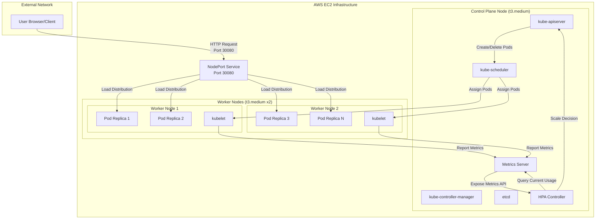
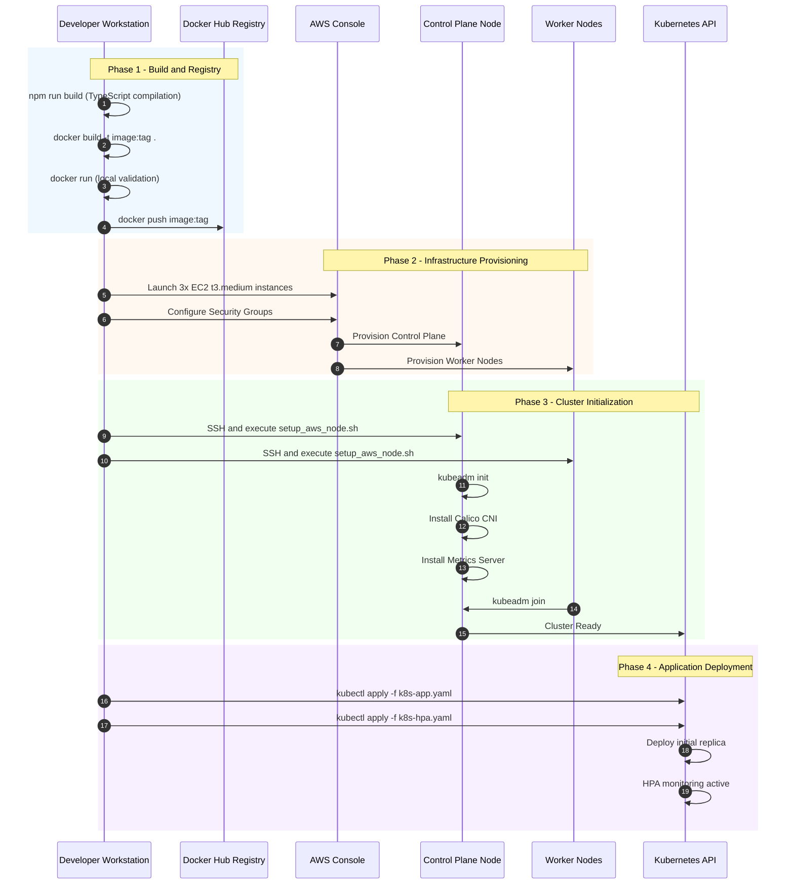
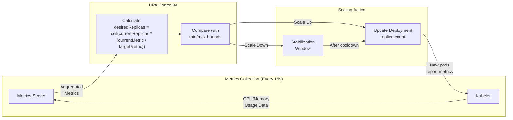
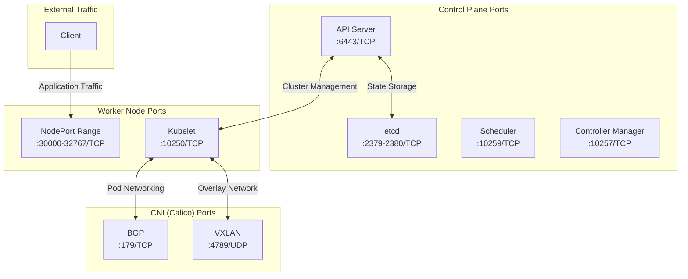

# Kubernetes Autoscaling on AWS EC2

**A Manual Implementation of Horizontal Pod Autoscaling in a Self-Managed Kubernetes Cluster**

---

## Table of Contents

1. [Project Abstract](#1-project-abstract)
2. [Technical Glossary](#2-technical-glossary)
3. [Architecture Diagrams](#3-architecture-diagrams)
   - [3.1 System Architecture](#31-system-architecture)
   - [3.2 Deployment Workflow](#32-deployment-workflow)
   - [3.3 HPA Decision Loop](#33-hpa-decision-loop)
   - [3.4 Network Communication Flow](#34-network-communication-flow)
4. [Project Code Explanation](#4-project-code-explanation)
   - [4.1 Dockerfile Configuration](#41-dockerfile-configuration)
   - [4.2 Docker Compose Configuration](#42-docker-compose-configuration)
   - [4.3 Kubernetes Manifests](#43-kubernetes-manifests)
   - [4.4 Automation Scripts](#44-automation-scripts)
5. [Prerequisites and Infrastructure Requirements](#5-prerequisites-and-infrastructure-requirements)
   - [5.1 Required Tools](#51-required-tools)
   - [5.2 AWS Infrastructure Requirements](#52-aws-infrastructure-requirements)
   - [5.3 Complete Port and Configuration Reference](#53-complete-port-and-configuration-reference)
6. [Implementation Guide](#6-implementation-guide)
   - [6.1 Phase 1: Local Verification](#61-phase-1-local-verification)
   - [6.2 Phase 2: AWS Production Deployment with Automated Scripts](#62-phase-2-aws-production-deployment-with-automated-scripts)
7. [Verification and Monitoring](#7-verification-and-monitoring)
   - [7.1 Presentation Dashboard Split-Screen Method](#71-presentation-dashboard-split-screen-method)
   - [7.2 Critical Metrics for Autoscaling Validation](#72-critical-metrics-for-autoscaling-validation)
8. [Cost Management and Cleanup](#8-cost-management-and-cleanup)
9. [Troubleshooting Reference](#9-troubleshooting-reference)
10. [References and Further Reading](#10-references-and-further-reading)

---

## 1. Project Abstract

This project provides a comprehensive implementation of a self-managed Kubernetes cluster deployed on Amazon Web Services (AWS) Elastic Compute Cloud (EC2) infrastructure. The primary objective is to demonstrate the operational mechanics of Horizontal Pod Autoscaling (HPA) in response to CPU-based workload stress.

**Key Differentiator:** This implementation deliberately bypasses AWS Elastic Kubernetes Service (EKS) to provide practitioners with hands-on exposure to the fundamental components of Kubernetes cluster administration. By manually configuring the control plane, worker nodes, container runtime, and networking layer, users gain deeper insight into the interdependencies that managed services typically abstract.

**Scope of Demonstration:**

- Manual provisioning of a three-node Kubernetes cluster (one control plane, two worker nodes)
- Configuration of the Container Runtime Interface (CRI) using containerd
- Deployment of the Calico Container Network Interface (CNI) plugin
- Installation and configuration of the Metrics Server for resource monitoring
- Implementation of HPA policies with defined scaling thresholds
- Validation of autoscaling behavior under synthetic CPU load

**Educational Outcomes:**
Upon completion, practitioners will possess the technical competency to deploy, configure, and troubleshoot Kubernetes clusters in environments where managed services are unavailable or cost-prohibitive.

---

## 2. Technical Glossary

The following table provides definitions for key technical terms used throughout this documentation. These definitions are intentionally simplified to facilitate understanding for readers with varying levels of expertise.

| Term                                  | Definition                                                                                                                                                                                                                                                                                             |
| ------------------------------------- | ------------------------------------------------------------------------------------------------------------------------------------------------------------------------------------------------------------------------------------------------------------------------------------------------------ |
| **NodePort**                          | A Kubernetes Service type that exposes an application on a static port (range 30000-32767) on every node in the cluster. External traffic can reach the application by connecting to any node's IP address on the designated port.                                                                     |
| **Horizontal Pod Autoscaler (HPA)**   | A Kubernetes controller that automatically adjusts the number of pod replicas in a deployment based on observed metrics (typically CPU or memory utilization). The HPA increases replicas when demand rises and decreases them when demand falls.                                                      |
| **Kubelet**                           | The primary node agent that runs on every worker node in the cluster. It ensures that containers described in PodSpecs are running and healthy. The kubelet communicates with the control plane to receive instructions and report node status.                                                        |
| **CNI (Container Network Interface)** | A specification and set of libraries for configuring network interfaces in Linux containers. In Kubernetes, CNI plugins (such as Calico, Flannel, or Weave) provide pod-to-pod networking across nodes.                                                                                                |
| **SystemdCgroup**                     | A configuration option for container runtimes that delegates cgroup (control group) management to systemd rather than the container runtime itself. This ensures consistency with how Kubernetes manages resource allocation and is required when using systemd as the init system.                    |
| **Swap Memory**                       | A portion of disk storage used as virtual memory when physical RAM is exhausted. Kubernetes requires swap to be disabled because the scheduler assumes predictable memory availability; swap introduces latency and unpredictable performance that conflicts with Quality of Service (QoS) guarantees. |
| **Metrics Server**                    | A cluster-wide aggregator of resource usage data. It collects CPU and memory metrics from kubelets and exposes them through the Kubernetes API. The HPA relies on Metrics Server data to make scaling decisions.                                                                                       |
| **Control Plane**                     | The set of components that manage the overall state of the cluster, including the API server, scheduler, controller manager, and etcd. The control plane makes global decisions about the cluster and detects and responds to cluster events.                                                          |
| **etcd**                              | A distributed key-value store that serves as the backing store for all Kubernetes cluster data. It stores configuration data, state, and metadata that the control plane requires to function.                                                                                                         |
| **Calico**                            | A CNI plugin that provides networking and network policy enforcement for Kubernetes. It uses BGP (Border Gateway Protocol) to route traffic between nodes without encapsulation, offering high performance.                                                                                            |

---

## 3. Architecture Diagrams

The following diagrams are rendered using Mermaid.js syntax. They illustrate the system architecture, deployment workflow, and scaling feedback mechanisms.

### 3.1 System Architecture

This diagram depicts the flow of user requests through the Kubernetes cluster and the feedback loop that enables autoscaling.



### 3.2 Deployment Workflow

This sequence diagram illustrates the complete deployment pipeline from local development to production operation.



### 3.3 HPA Decision Loop

This diagram illustrates the continuous feedback loop that governs autoscaling decisions.



### 3.4 Network Communication Flow

This diagram details the network ports and protocols required for cluster communication.



---

## 4. Project Code Explanation

This section provides detailed explanations of all configuration files and scripts used in the project. Understanding these components is essential for successful deployment and troubleshooting.

### 4.1 Dockerfile Configuration

The project uses a multi-stage Docker build to optimize image size and security.

**File:** [Dockerfile](Dockerfile)

```dockerfile
# Build stage - Compiles TypeScript to JavaScript
FROM node:20-alpine AS builder
WORKDIR /app
COPY package*.json tsconfig.json ./
RUN npm ci
COPY src ./src
RUN npm run build

# Production stage - Minimal runtime image
FROM node:20-alpine
WORKDIR /app
COPY package*.json ./
RUN npm ci --only=production && npm cache clean --force
COPY --from=builder /app/dist ./dist

# Security: Non-root user
RUN addgroup -g 1001 -S nodejs && adduser -S nodejs -u 1001
RUN chown -R nodejs:nodejs /app
USER nodejs

EXPOSE 3000

# Health check for container orchestration
HEALTHCHECK --interval=30s --timeout=3s --start-period=5s --retries=3 \
    CMD node -e "require('http').get('http://localhost:3000/health', (r) => {process.exit(r.statusCode === 200 ? 0 : 1)})"

CMD ["node", "dist/server.js"]
```

**Key Features:**

- **Two-Stage Build:** Reduces final image size by excluding development dependencies and source code
- **Alpine Base:** Uses minimal Alpine Linux for security and efficiency
- **Non-Root User:** Runs as user ID 1001 to prevent privilege escalation
- **Health Check:** Enables Kubernetes liveness/readiness probes
- **Production Dependencies Only:** Final stage contains only runtime dependencies

### 4.2 Docker Compose Configuration

For local testing without Kubernetes overhead.

**File:** [docker-compose.yml](docker-compose.yml)

```yaml
version: "3.8"
services:
  app:
    build:
      context: .
      dockerfile: Dockerfile
    image: k8s-autoscaling-demo:local
    ports:
      - "3000:3000"
    environment:
      - NODE_ENV=production
      - PORT=3000
    restart: unless-stopped
    healthcheck:
      test:
        [
          "CMD",
          "node",
          "-e",
          "require('http').get('http://localhost:3000/health', ...)",
        ]
      interval: 30s
      timeout: 3s
```

**Purpose:** Provides quick local validation before cloud deployment. No HPA functionality, but confirms application logic works correctly.

### 4.3 Kubernetes Manifests

#### 4.3.1 Application Deployment and Service

**File:** [k8s-app.yaml](k8s-app.yaml)

```yaml
apiVersion: apps/v1
kind: Deployment
metadata:
  name: k8s-autoscaling-app
spec:
  replicas: 1 # Initial replica count (HPA will modify this)
  template:
    spec:
      containers:
        - name: app
          image: adamabd97/k8s-autoscaling-demo:latest
          ports:
            - containerPort: 3000
          resources:
            requests:
              cpu: 100m # Guaranteed CPU allocation
              memory: 128Mi # Guaranteed memory allocation
            limits:
              cpu: 500m # Maximum CPU allowed
              memory: 256Mi # Maximum memory allowed
          livenessProbe: # Restart container if unhealthy
            httpGet:
              path: /health
              port: 3000
            initialDelaySeconds: 10
            periodSeconds: 10
          readinessProbe: # Remove from service if not ready
            httpGet:
              path: /health
              port: 3000
            initialDelaySeconds: 5
            periodSeconds: 5
---
apiVersion: v1
kind: Service
metadata:
  name: k8s-autoscaling-service
spec:
  type: NodePort
  ports:
    - port: 80 # Service internal port
      targetPort: 3000 # Container port
      nodePort: 30080 # External access port on all nodes
  selector:
    app: k8s-autoscaling
```

**Critical Configuration Details:**

- **Resource Requests:** Used by HPA to calculate CPU utilization percentage
  - Formula: `currentUtilization = (actualCPU / requestedCPU) * 100`
  - Example: If pod uses 50m CPU, utilization = (50m / 100m) \* 100 = 50%
- **Resource Limits:** Prevents runaway processes from consuming all node resources
- **Probes:** Liveness restarts failed containers; readiness manages traffic routing
- **NodePort 30080:** Allows external access on `http://<NODE_IP>:30080`

#### 4.3.2 Horizontal Pod Autoscaler

**File:** [k8s-hpa.yaml](k8s-hpa.yaml)

```yaml
apiVersion: autoscaling/v2
kind: HorizontalPodAutoscaler
metadata:
  name: k8s-autoscaling-hpa
spec:
  scaleTargetRef:
    apiVersion: apps/v1
    kind: Deployment
    name: k8s-autoscaling-app
  minReplicas: 1
  maxReplicas: 10
  metrics:
    - type: Resource
      resource:
        name: cpu
        target:
          type: Utilization
          averageUtilization: 50 # Target 50% CPU across all pods
  behavior:
    scaleUp:
      stabilizationWindowSeconds: 0 # Scale up immediately
      policies:
        - type: Percent
          value: 100 # Double replicas per 15s
          periodSeconds: 15
        - type: Pods
          value: 2 # OR add 2 pods per 15s
          periodSeconds: 15
      selectPolicy: Max # Use whichever adds more pods
    scaleDown:
      stabilizationWindowSeconds: 60 # Wait 60s before scaling down
      policies:
        - type: Percent
          value: 50 # Remove 50% of pods per 15s
          periodSeconds: 15
        - type: Pods
          value: 1 # OR remove 1 pod per 15s
          periodSeconds: 15
      selectPolicy: Min # Use whichever removes fewer pods
```

**Scaling Logic Explanation:**

- **Target 50% CPU:** HPA tries to maintain average CPU at 50% by adjusting replica count
- **Scale-Up Aggressive:** No delay, doubles pods or adds 2 (whichever is more)
- **Scale-Down Conservative:** Waits 60s, removes slowly to prevent flapping
- **Desired Replicas Calculation:**
  ```
  desiredReplicas = ceil(currentReplicas * (currentCPU / targetCPU))
  Example: ceil(2 * (75% / 50%)) = ceil(3) = 3 replicas
  ```

#### 4.3.3 RBAC Permissions

**File:** [k8s-rbac.yaml](k8s-rbac.yaml)

```yaml
apiVersion: v1
kind: ServiceAccount
metadata:
  name: dashboard-sa
---
apiVersion: rbac.authorization.k8s.io/v1
kind: Role
metadata:
  name: dashboard-role
rules:
  - apiGroups: [""]
    resources: ["pods", "services"]
    verbs: ["get", "list", "watch"]
  - apiGroups: ["autoscaling"]
    resources: ["horizontalpodautoscalers"]
    verbs: ["get", "list", "watch"]
---
apiVersion: rbac.authorization.k8s.io/v1
kind: RoleBinding
metadata:
  name: dashboard-rb
subjects:
  - kind: ServiceAccount
    name: dashboard-sa
roleRef:
  kind: Role
  name: dashboard-role
```

**Purpose:** Grants the application pods read-only access to cluster resources for displaying real-time dashboard data. Without these permissions, the `/cluster-status` endpoint would fail with authorization errors.

### 4.4 Automation Scripts

#### 4.4.1 setup_aws_node.sh

**Purpose:** Automates complete node setup on AWS EC2 Ubuntu 22.04 instances.

**File:** [setup_aws_node.sh](setup_aws_node.sh)

**What It Does:**

1. Disables swap memory (required by Kubernetes)
2. Loads kernel modules (overlay, br_netfilter)
3. Configures sysctl networking parameters
4. Installs containerd runtime
5. Configures containerd with SystemdCgroup
6. Installs kubeadm, kubelet, kubectl v1.28
7. Prevents automatic package upgrades

**Usage on AWS:**

```bash
# On each EC2 node (control plane and workers)
sudo bash setup_aws_node.sh
```

**Execution Time:** Approximately 2-3 minutes per node

#### 4.4.2 local-setup-ubuntu.sh

**Purpose:** Installs local development tools on Ubuntu workstations.

**File:** [local-setup-ubuntu.sh](local-setup-ubuntu.sh)

**What It Does:**

1. Installs Docker Engine and Docker Compose plugin
2. Installs kubectl for cluster management
3. Installs Minikube for local Kubernetes testing
4. Configures conntrack (required by CNI plugins)

**Usage:**

```bash
sudo bash local-setup-ubuntu.sh
```

#### 4.4.3 local-setup-fedora.sh

**Purpose:** Installs local development tools on Fedora workstations.

**File:** [local-setup-fedora.sh](local-setup-fedora.sh)

**What It Does:**

1. Installs Podman (Docker alternative) and podman-docker compatibility layer
2. Installs podman-compose
3. Installs kubectl and Minikube
4. Configures conntrack

**Usage:**

```bash
sudo bash local-setup-fedora.sh
```

#### 4.4.4 local-test.sh

**Purpose:** Comprehensive local testing with Docker Compose or Minikube.

**File:** [local-test.sh](local-test.sh)

**What It Does:**

1. Auto-detects container engine (Docker/Podman)
2. Auto-detects Linux distribution
3. Offers to run appropriate setup script if tools missing
4. Tests application with Docker Compose (basic validation)
5. Tests application with Minikube (full HPA validation)

**Usage:**

```bash
# Docker Compose test
bash local-test.sh docker

# Minikube test with HPA
bash local-test.sh minikube
```

#### 4.4.5 load-generator.sh

**Purpose:** Generates HTTP load to trigger HPA autoscaling.

**File:** [load-generator.sh](load-generator.sh)

**What It Does:**

1. Sends concurrent HTTP requests to `/cpu-load` endpoint
2. Measures response times
3. Configurable request count and concurrency

**Usage:**

```bash
# Basic usage (100 requests, 10 concurrent)
bash load-generator.sh http://NODE_IP:30080

# Custom load (200 requests, 20 concurrent)
bash load-generator.sh http://NODE_IP:30080 200 20

# Minikube
bash load-generator.sh $(minikube service k8s-autoscaling-service --url) 150 15
```

**Expected Behavior:** After 30-60 seconds of sustained load, HPA should increase replica count.

---

## 5. Prerequisites and Infrastructure Requirements

### 4.1 Required Tools

The following software must be installed on the developer workstation prior to beginning implementation:

| Tool       | Minimum Version | Purpose                                              |
| ---------- | --------------- | ---------------------------------------------------- |
| Docker     | 20.10+          | Container image building and local testing           |
| kubectl    | 1.28+           | Kubernetes cluster management                        |
| AWS CLI    | 2.0+            | AWS resource provisioning (optional but recommended) |
| SSH Client | Any             | Remote access to EC2 instances                       |
| Git        | 2.0+            | Repository cloning and version control               |
| Node.js    | 20.0+           | Application runtime (for local development)          |

**Installation Verification Commands:**

```bash
docker --version
kubectl version --client
aws --version
ssh -V
git --version
node --version
```

### 4.2 AWS Infrastructure Requirements

#### Critical Instance Type Requirement

**WARNING:** The Kubernetes control plane requires a minimum of 2 vCPUs to function correctly. The `kubeadm init` command will fail on instances with fewer than 2 vCPUs.

| Instance Type | vCPUs | Memory | Suitability                |
| ------------- | ----- | ------ | -------------------------- |
| t2.micro      | 1     | 1 GB   | NOT SUITABLE - Will fail   |
| t2.small      | 1     | 2 GB   | NOT SUITABLE - Will fail   |
| t3.medium     | 2     | 4 GB   | MINIMUM RECOMMENDED        |
| t3.large      | 2     | 8 GB   | Recommended for production |

**Technical Rationale:** The control plane components (API server, scheduler, controller manager, etcd) are CPU-intensive processes that require concurrent execution. Single-vCPU instances cannot provide the parallel processing capacity needed for cluster orchestration.

#### Required EC2 Instances

| Node Role     | Count | Instance Type | Storage   | Operating System |
| ------------- | ----- | ------------- | --------- | ---------------- |
| Control Plane | 1     | t3.medium     | 20 GB gp3 | Ubuntu 22.04 LTS |
| Worker        | 2     | t3.medium     | 20 GB gp3 | Ubuntu 22.04 LTS |

#### Security Group Configuration

Create a security group with the following inbound rules. Pay particular attention to the self-referencing rule that enables internal cluster communication.

| Rule Name          | Type       | Protocol | Port Range  | Source                   | Purpose                     |
| ------------------ | ---------- | -------- | ----------- | ------------------------ | --------------------------- |
| SSH Access         | SSH        | TCP      | 22          | Your IP/32               | Administrative access       |
| Kubernetes API     | Custom TCP | TCP      | 6443        | Security Group ID (self) | Control plane communication |
| etcd Server        | Custom TCP | TCP      | 2379-2380   | Security Group ID (self) | Cluster state storage       |
| Kubelet API        | Custom TCP | TCP      | 10250       | Security Group ID (self) | Node agent communication    |
| Kube-Scheduler     | Custom TCP | TCP      | 10259       | Security Group ID (self) | Pod scheduling              |
| Controller Manager | Custom TCP | TCP      | 10257       | Security Group ID (self) | Cluster controllers         |
| NodePort Services  | Custom TCP | TCP      | 30000-32767 | 0.0.0.0/0                | External application access |
| Calico BGP         | Custom TCP | TCP      | 179         | Security Group ID (self) | CNI routing                 |
| Calico VXLAN       | Custom UDP | UDP      | 4789        | Security Group ID (self) | CNI overlay network         |

**Technical Rationale for Self-Referencing Rules:** When a security group references itself as a source, it permits all instances within that security group to communicate with each other on the specified ports. This is essential because Kubernetes nodes must exchange control plane traffic, pod networking data, and health status information freely. Without self-referencing rules, the cluster components cannot communicate, and the cluster will fail to initialize.

### 5.3 Complete Port and Configuration Reference

This comprehensive table documents all network ports, protocols, and their purposes in the Kubernetes cluster.

#### 5.3.1 Control Plane Ports

| Port Range | Protocol | Component               | Direction | Purpose                                           | Security Group Rule |
| ---------- | -------- | ----------------------- | --------- | ------------------------------------------------- | ------------------- |
| 6443       | TCP      | kube-apiserver          | Inbound   | Kubernetes API server (all cluster communication) | Self-referencing    |
| 2379-2380  | TCP      | etcd                    | Inbound   | etcd server client/peer communication             | Self-referencing    |
| 10250      | TCP      | kubelet                 | Inbound   | Kubelet API (metrics, logs, exec)                 | Self-referencing    |
| 10259      | TCP      | kube-scheduler          | Inbound   | Scheduler health checks                           | Self-referencing    |
| 10257      | TCP      | kube-controller-manager | Inbound   | Controller manager health checks                  | Self-referencing    |

#### 5.3.2 Worker Node Ports

| Port Range  | Protocol | Component               | Direction | Purpose                             | Security Group Rule        |
| ----------- | -------- | ----------------------- | --------- | ----------------------------------- | -------------------------- |
| 10250       | TCP      | kubelet                 | Inbound   | Kubelet API (same as control plane) | Self-referencing           |
| 30000-32767 | TCP      | NodePort Services       | Inbound   | External access to services         | 0.0.0.0/0 or specific CIDR |
| 30080       | TCP      | k8s-autoscaling-service | Inbound   | Application HTTP endpoint           | 0.0.0.0/0                  |

#### 5.3.3 CNI (Calico) Ports

| Port Range | Protocol | Component    | Direction     | Purpose                                    | Security Group Rule |
| ---------- | -------- | ------------ | ------------- | ------------------------------------------ | ------------------- |
| 179        | TCP      | Calico BGP   | Bidirectional | BGP routing protocol for pod networking    | Self-referencing    |
| 4789       | UDP      | Calico VXLAN | Bidirectional | VXLAN overlay network (if IPinIP not used) | Self-referencing    |

#### 5.3.4 Administrative Access

| Port Range | Protocol | Component | Direction | Purpose               | Security Group Rule |
| ---------- | -------- | --------- | --------- | --------------------- | ------------------- |
| 22         | TCP      | SSH       | Inbound   | Remote administration | Your IP/32          |

#### 5.3.5 Application-Specific Ports

| Port  | Protocol | Component          | Scope              | Purpose                                          |
| ----- | -------- | ------------------ | ------------------ | ------------------------------------------------ |
| 3000  | TCP      | Node.js App        | Internal (Pod)     | Application HTTP server (not exposed externally) |
| 80    | TCP      | Kubernetes Service | Internal (Cluster) | Service abstraction layer                        |
| 30080 | TCP      | NodePort           | External           | Public access mapped to Service port 80          |

#### 5.3.6 Resource Quotas and Limits

These values are defined in [k8s-app.yaml](k8s-app.yaml) and directly affect HPA calculations.

| Resource Type | Request | Limit | Purpose                                            |
| ------------- | ------- | ----- | -------------------------------------------------- |
| CPU           | 100m    | 500m  | Guarantees 0.1 CPU core, allows burst to 0.5 cores |
| Memory        | 128Mi   | 256Mi | Guarantees 128MB, allows burst to 256MB            |

**HPA Utilization Calculation:**

```
CPU Utilization % = (Actual CPU Usage / CPU Request) * 100
Example: Pod using 75m CPU = (75m / 100m) * 100 = 75% utilization
```

#### 5.3.7 HPA Configuration Parameters

Defined in [k8s-hpa.yaml](k8s-hpa.yaml):

| Parameter                            | Value | Purpose                                                 |
| ------------------------------------ | ----- | ------------------------------------------------------- |
| minReplicas                          | 1     | Minimum pods even at zero load                          |
| maxReplicas                          | 10    | Maximum pods to prevent resource exhaustion             |
| targetAverageUtilization             | 50%   | HPA maintains average CPU at 50% across all pods        |
| scaleUp.stabilizationWindowSeconds   | 0     | Scale up immediately when threshold exceeded            |
| scaleDown.stabilizationWindowSeconds | 60    | Wait 60 seconds before scaling down to prevent flapping |
| scaleUp.policies.Percent.value       | 100   | Double replica count every 15 seconds                   |
| scaleUp.policies.Pods.value          | 2     | OR add 2 pods every 15 seconds (whichever is greater)   |
| scaleDown.policies.Percent.value     | 50    | Reduce by 50% every 15 seconds                          |
| scaleDown.policies.Pods.value        | 1     | OR remove 1 pod every 15 seconds (whichever is smaller) |

---

## 6. Implementation Guide

### 6.1 Phase 1: Local Verification

Before provisioning AWS infrastructure, validate that the application functions correctly in a local environment. This practice prevents costly debugging on cloud resources.

#### Option A: Docker Compose Testing (No Autoscaling)

This method provides rapid validation of the application container without Kubernetes overhead.

```bash
# Clone the repository
git clone https://github.com/Adamo-97/k8s_autoscaling.git
cd k8s_autoscaling

# Start the application using Docker Compose
docker compose up --build -d

# Verify the application is running
curl http://localhost:3000/health

# Expected response:
# {"status":"healthy","pod":"<container-id>","timestamp":"..."}

# Test the CPU load endpoint
curl http://localhost:3000/cpu-load

# Access the dashboard
# Open http://localhost:3000 in a web browser

# Cleanup
docker compose down
```

#### Option B: Minikube Testing (Full Autoscaling)

This method provides a complete HPA demonstration in a local Kubernetes environment.

```bash
# Start Minikube with sufficient resources
minikube start --driver=docker --cpus=2 --memory=4096

# Enable the metrics-server addon
minikube addons enable metrics-server

# Build the application image within Minikube's Docker context
eval $(minikube docker-env)
docker build -t k8s-autoscaling-demo:latest .

# Create a local manifest with the correct image reference
sed 's|YOUR_DOCKERHUB_USERNAME/k8s-autoscaling-demo:latest|k8s-autoscaling-demo:latest|g' \
    k8s-app.yaml > k8s-app-local.yaml
echo '        imagePullPolicy: Never' >> k8s-app-local.yaml

# Deploy the application
kubectl apply -f k8s-app-local.yaml
kubectl apply -f k8s-hpa.yaml

# Wait for pods to be ready
kubectl wait --for=condition=ready pod -l app=k8s-autoscaling --timeout=120s

# Get the service URL
minikube service k8s-autoscaling-service --url

# Monitor HPA in a separate terminal
watch -n 1 kubectl get hpa,pods

# Generate load to trigger scaling (run in another terminal)
SERVICE_URL=$(minikube service k8s-autoscaling-service --url)
for i in $(seq 1 50); do
    curl -s "${SERVICE_URL}/cpu-load" &
    sleep 0.5
done

# Cleanup
kubectl delete -f k8s-hpa.yaml
kubectl delete -f k8s-app-local.yaml
minikube stop
```

### 6.2 Phase 2: AWS Production Deployment with Automated Scripts

This section provides detailed instructions for deploying the Kubernetes cluster on AWS EC2 infrastructure using the automated setup scripts.

#### Step 1: Prepare the Docker Image

Before deploying to AWS, the container image must be available in a public registry.

```bash
# Build the production image
docker build -t YOUR_DOCKERHUB_USERNAME/k8s-autoscaling-demo:latest .

# Authenticate with Docker Hub
docker login

# Push the image to Docker Hub
docker push YOUR_DOCKERHUB_USERNAME/k8s-autoscaling-demo:latest
```

**Technical Rationale:** Kubernetes worker nodes pull container images from registries. By pushing to Docker Hub (or another accessible registry), we ensure that all nodes can retrieve the application image during deployment.

#### Step 2: Launch EC2 Instances

Using the AWS Console or CLI, launch three EC2 instances with the specifications defined in Section 5.2.

**AWS Console Method:**

1. Navigate to EC2 Dashboard
2. Select "Launch Instance"
3. Choose Ubuntu Server 22.04 LTS AMI
4. Select t3.medium instance type
5. Configure storage: 20 GB gp3
6. Select or create the security group defined in Section 5.2
7. Launch three instances with descriptive names:
   - `k8s-control-plane`
   - `k8s-worker-1`
   - `k8s-worker-2`

**AWS CLI Method:**

```bash
# Create security group
aws ec2 create-security-group \
    --group-name k8s-cluster-sg \
    --description "Security group for Kubernetes cluster"

# Add security group rules (repeat for each rule in Section 4.2)
aws ec2 authorize-security-group-ingress \
    --group-name k8s-cluster-sg \
    --protocol tcp \
    --port 22 \
    --cidr YOUR_IP/32

# Launch instances
aws ec2 run-instances \
    --image-id ami-0c7217cdde317cfec \
    --instance-type t3.medium \
    --count 3 \
    --key-name your-key-pair \
    --security-groups k8s-cluster-sg \
    --block-device-mappings '[{"DeviceName":"/dev/sda1","Ebs":{"VolumeSize":20,"VolumeType":"gp3"}}]'
```

#### Step 3: Copy Setup Script to AWS Nodes

Transfer the automation script to all EC2 instances to simplify configuration.

**Method 1: Using SCP (Secure Copy)**

```bash
# Copy the script to each node
scp -i your-key.pem setup_aws_node.sh ubuntu@<CONTROL_PLANE_IP>:~
scp -i your-key.pem setup_aws_node.sh ubuntu@<WORKER1_IP>:~
scp -i your-key.pem setup_aws_node.sh ubuntu@<WORKER2_IP>:~
```

**Method 2: Using Git Clone (if repository is public)**

```bash
# On each node
ssh -i your-key.pem ubuntu@<NODE_IP>
git clone https://github.com/Adamo-97/k8s_autoscaling.git
cd k8s_autoscaling
```

**Method 3: Direct Download (using curl/wget)**

```bash
# On each node
ssh -i your-key.pem ubuntu@<NODE_IP>
curl -O https://raw.githubusercontent.com/Adamo-97/k8s_autoscaling/main/setup_aws_node.sh
chmod +x setup_aws_node.sh
```

#### Step 4: Run Automated Setup on All Nodes

Execute the setup script on each node (control plane and both workers). This script automates all manual configuration steps.

**Script Execution Order:**

1. **Control Plane Node** - Run setup script FIRST
2. **Worker Node 1** - Run setup script SECOND
3. **Worker Node 2** - Run setup script THIRD

**On Each Node (Control Plane and Workers):**

```bash
# Connect to the node
ssh -i your-key.pem ubuntu@<NODE_IP>

# Run the setup script with sudo
sudo bash setup_aws_node.sh
```

**What the Script Does:**

The `setup_aws_node.sh` script automates the following steps:

1. Disables swap memory
2. Loads kernel modules (overlay, br_netfilter)
3. Configures sysctl networking parameters
4. Installs and configures containerd runtime with SystemdCgroup
5. Installs kubeadm, kubelet, and kubectl (version 1.28)
6. Enables kubelet service
7. Holds package versions to prevent automatic upgrades

**Expected Output:**

```
===========================================
   Kubernetes Node Setup - Ubuntu 22.04
===========================================

[STEP 1] Disabling swap...
[OK] Swap disabled

[STEP 2] Loading kernel modules...
[OK] Kernel modules loaded

[STEP 3] Configuring sysctl parameters...
[OK] Sysctl parameters configured

[STEP 4] Installing containerd...
[OK] containerd installed

[STEP 5] Configuring containerd with SystemdCgroup...
[OK] containerd configured and started

[STEP 6] Installing kubeadm, kubelet, kubectl...
[OK] Kubernetes components installed and held

[STEP 7] Enabling kubelet service...
[OK] kubelet enabled

===========================================
[SUCCESS] Setup Complete!
===========================================
```

**Execution Time:** Approximately 2-3 minutes per node

**Technical Rationale:** Using the automated script ensures consistency across all nodes, reduces human error, and documents the exact configuration steps in version-controlled code.

#### Step 4 (Deprecated - Manual Configuration)

The following manual steps are documented for reference but are NOT REQUIRED if using `setup_aws_node.sh`.

<details>
<summary>Click to expand manual configuration steps (not recommended)</summary>

**3.2: Disable Swap Memory**

```bash
sudo swapoff -a
sudo sed -i '/ swap / s/^/#/' /etc/fstab
```

**Technical Rationale:** Kubernetes requires swap to be disabled because the scheduler makes memory allocation decisions based on available RAM. When swap is enabled, memory availability becomes unpredictable, which violates the assumptions of the Quality of Service (QoS) model. The kubelet will refuse to start if swap is detected.

**3.3: Load Required Kernel Modules**

```bash
cat <<EOF | sudo tee /etc/modules-load.d/containerd.conf
overlay
br_netfilter
EOF

sudo modprobe overlay
sudo modprobe br_netfilter
```

**Technical Rationale:**

- `overlay`: Required by containerd for layered filesystem support in containers
- `br_netfilter`: Enables iptables to see bridged traffic, which is necessary for Kubernetes networking rules to function correctly

**3.4: Configure Kernel Parameters**

```bash
cat <<EOF | sudo tee /etc/sysctl.d/99-kubernetes-cri.conf
net.bridge.bridge-nf-call-iptables  = 1
net.ipv4.ip_forward                 = 1
net.bridge.bridge-nf-call-ip6tables = 1
EOF

sudo sysctl --system
```

**Technical Rationale:** These parameters enable:

- IP forwarding between network interfaces (required for pod-to-pod communication across nodes)
- Bridge traffic to be processed by iptables (required for Service load balancing and Network Policies)

**3.5: Install containerd**

```bash
sudo apt-get update
sudo apt-get install -y apt-transport-https ca-certificates curl software-properties-common

curl -fsSL https://download.docker.com/linux/ubuntu/gpg | sudo gpg --dearmor -o /usr/share/keyrings/docker-archive-keyring.gpg

echo "deb [arch=$(dpkg --print-architecture) signed-by=/usr/share/keyrings/docker-archive-keyring.gpg] https://download.docker.com/linux/ubuntu $(lsb_release -cs) stable" | sudo tee /etc/apt/sources.list.d/docker.list > /dev/null

sudo apt-get update
sudo apt-get install -y containerd.io
```

**3.6: Configure containerd with SystemdCgroup**

```bash
sudo mkdir -p /etc/containerd
containerd config default | sudo tee /etc/containerd/config.toml > /dev/null
sudo sed -i 's/SystemdCgroup = false/SystemdCgroup = true/' /etc/containerd/config.toml
sudo systemctl restart containerd
sudo systemctl enable containerd
```

**Technical Rationale:** Ubuntu 22.04 uses systemd as its init system. The kubelet also uses systemd to manage cgroups. If containerd uses a different cgroup driver (cgroupfs), there will be two cgroup managers competing for resources, causing instability. Setting `SystemdCgroup = true` ensures containerd delegates cgroup management to systemd, maintaining consistency.

**3.7: Install Kubernetes Components**

```bash
curl -fsSL https://pkgs.k8s.io/core:/stable:/v1.28/deb/Release.key | sudo gpg --dearmor -o /usr/share/keyrings/kubernetes-apt-keyring.gpg

echo 'deb [signed-by=/usr/share/keyrings/kubernetes-apt-keyring.gpg] https://pkgs.k8s.io/core:/stable:/v1.28/deb/ /' | sudo tee /etc/apt/sources.list.d/kubernetes.list

sudo apt-get update
sudo apt-get install -y kubelet kubeadm kubectl
sudo apt-mark hold kubelet kubeadm kubectl
```

**Technical Rationale:** The `apt-mark hold` command prevents automatic upgrades of Kubernetes components. Version mismatches between nodes can cause cluster instability; all nodes should run identical versions.

</details>

#### Step 5: Initialize the Control Plane

Execute the following commands ONLY on the control plane node.

```bash
# Initialize the Kubernetes control plane
sudo kubeadm init --pod-network-cidr=192.168.0.0/16
```

**IMPORTANT:** Save the `kubeadm join` command from the output. It will look like this:

```
kubeadm join <CONTROL_PLANE_IP>:6443 --token <TOKEN> \
    --discovery-token-ca-cert-hash sha256:<HASH>
```

**Configure kubectl Access:**

```bash
# Configure kubectl for the ubuntu user
mkdir -p $HOME/.kube
sudo cp -i /etc/kubernetes/admin.conf $HOME/.kube/config
sudo chown $(id -u):$(id -g) $HOME/.kube/config

# Verify the control plane is running
kubectl get nodes

# Expected output:
# NAME              STATUS     ROLES           AGE   VERSION
# k8s-control-plane NotReady   control-plane   30s   v1.28.x
```

**Note:** The node shows `NotReady` until the CNI plugin is installed in the next step.

**Technical Rationale for Pod Network CIDR:** The `--pod-network-cidr=192.168.0.0/16` parameter specifies the IP address range for pod networking. This value is required by Calico CNI; using a different CIDR requires corresponding changes to the Calico manifest.

#### Step 6: Install Calico CNI

Execute on the control plane node:

```bash
kubectl apply -f https://raw.githubusercontent.com/projectcalico/calico/v3.26.1/manifests/calico.yaml

# Wait for Calico pods to be ready (press Ctrl+C when all pods are Running)
kubectl get pods -n kube-system -w

# Verify node is now Ready
kubectl get nodes
```

**Expected Output:**

```
NAME              STATUS   ROLES           AGE   VERSION
k8s-control-plane Ready    control-plane   2m    v1.28.x
```

**Technical Rationale:** Without a CNI plugin, pods cannot communicate across nodes. Calico provides layer 3 networking using BGP, offering high performance without encapsulation overhead. It also provides Network Policy enforcement for pod-level firewall rules.

#### Step 7: Join Worker Nodes

Execute the saved `kubeadm join` command on EACH worker node:

```bash
# On Worker Node 1
ssh -i your-key.pem ubuntu@<WORKER1_IP>
sudo kubeadm join <CONTROL_PLANE_IP>:6443 --token <TOKEN> \
    --discovery-token-ca-cert-hash sha256:<HASH>

# On Worker Node 2
ssh -i your-key.pem ubuntu@<WORKER2_IP>
sudo kubeadm join <CONTROL_PLANE_IP>:6443 --token <TOKEN> \
    --discovery-token-ca-cert-hash sha256:<HASH>
```

Verify on the control plane:

```bash
kubectl get nodes

# Expected output:
# NAME              STATUS   ROLES           AGE   VERSION
# k8s-control-plane Ready    control-plane   5m    v1.28.x
# k8s-worker-1      Ready    <none>          2m    v1.28.x
# k8s-worker-2      Ready    <none>          2m    v1.28.x
```

#### Step 7: Install Metrics Server

The Metrics Server is required for HPA functionality.

```bash
# Download the manifest
wget https://github.com/kubernetes-sigs/metrics-server/releases/latest/download/components.yaml

# Add the --kubelet-insecure-tls flag (required for self-signed certificates)
sed -i '/- args:/a\        - --kubelet-insecure-tls' components.yaml

# Apply the manifest
kubectl apply -f components.yaml

# Verify installation (may take 1-2 minutes)
kubectl get deployment metrics-server -n kube-system
kubectl top nodes
```

**Technical Rationale:** In self-managed clusters, kubelets use self-signed certificates. The Metrics Server, by default, requires valid TLS certificates. The `--kubelet-insecure-tls` flag bypasses this verification. In production environments, proper certificate management should be implemented instead.

#### Step 9: Deploy RBAC, Application, and HPA

```bash
# Update k8s-app.yaml with your Docker Hub username
sed -i 's|adamabd97/k8s-autoscaling-demo:latest|YOUR_DOCKERHUB_USERNAME/k8s-autoscaling-demo:latest|g' k8s-app.yaml

# Apply RBAC permissions
kubectl apply -f k8s-rbac.yaml

# Apply application and HPA
kubectl apply -f k8s-app.yaml
kubectl apply -f k8s-hpa.yaml

# Verify deployment
kubectl get hpa
```

#### Step 10: Access and Test

```bash
# Get node IP
kubectl get nodes -o wide

# Test: http://<NODE_IP>:30080
curl http://<NODE_IP>:30080/health

# Copy load generator (optional)
scp -i your-key.pem load-generator.sh ubuntu@<CONTROL_PLANE_IP>:~
```

---

## 7. Verification and Monitoring

### 7.1 Presentation Dashboard Split-Screen Method

For demonstration and grading purposes, the following "Split-Screen Method" provides clear visual evidence of autoscaling behavior.

#### Screen 1: Infrastructure Level (AWS Console)

This view demonstrates that EC2 instance CPU utilization increases during load testing.

**Steps:**

1. Log in to the AWS Console
2. Navigate to EC2 > Instances
3. Select one of the worker nodes
4. Click the "Monitoring" tab
5. Locate the "CPU Utilization" graph
6. Set the time range to "1 hour" with "1 minute" granularity

**What to Observe:** During load testing, CPU utilization should rise from baseline (typically 1-5%) to elevated levels (20-50% or higher depending on load intensity).

#### Screen 2: Application Level (Terminal)

This view demonstrates that the HPA responds to increased CPU utilization by creating additional pod replicas.

**Command:**

```bash
watch -n 1 'kubectl get hpa,pods -o wide'
```

**What to Observe:**

- The HPA `TARGETS` column shows current CPU usage versus the target (e.g., `75%/50%`)
- The `REPLICAS` column increases from 1 to 2, 3, or more
- New pods appear in the pod list with `Running` status

### 7.2 Critical Metrics for Autoscaling Validation on AWS

The following metrics must be monitored to demonstrate successful HPA implementation.

#### 7.2.1 Pod-Level Metrics

**Command:**

```bash
kubectl top pods
```

**Expected Values:**

| State      | CPU Usage      | Memory Usage    | Replica Count      |
| ---------- | -------------- | --------------- | ------------------ |
| Idle       | 1-5m           | 30-50Mi         | 1                  |
| Under Load | 50-100m+       | 50-80Mi         | 1 (before scaling) |
| Scaled Up  | 30-60m per pod | 45-65Mi per pod | 2-10 (distributed) |

#### 7.2.2 HPA Metrics

**Command:**

```bash
kubectl get hpa
kubectl describe hpa k8s-autoscaling-hpa
```

**Key Fields:**

| Field    | Idle   | Under Load | Scaling | Post-Scale |
| -------- | ------ | ---------- | ------- | ---------- |
| TARGETS  | 0%/50% | 75%/50%    | 65%/50% | 45%/50%    |
| REPLICAS | 1      | 1->2->3    | 3       | 3 (stable) |

**Critical Events:**

```yaml
Events:
  Normal  SuccessfulRescale  30s  horizontal-pod-autoscaler  New size: 2; reason: cpu resource utilization above target
  Normal  SuccessfulRescale  15s  horizontal-pod-autoscaler  New size: 3; reason: cpu resource utilization above target
```

#### 7.2.3 Node-Level Metrics

**Command:**

```bash
kubectl top nodes
```

**Expected Values:**

| Node Type     | CPU (Idle) | CPU (Load) | Memory Usage |
| ------------- | ---------- | ---------- | ------------ |
| Control Plane | 5-10%      | 10-15%     | 800Mi-1.2Gi  |
| Worker 1      | 2-5%       | 15-40%     | 600Mi-1Gi    |
| Worker 2      | 2-5%       | 15-40%     | 600Mi-1Gi    |

#### 7.2.4 AWS CloudWatch Metrics

Monitor in AWS Console:

| Metric          | Idle      | Under Load  | Alert At       |
| --------------- | --------- | ----------- | -------------- |
| CPU Utilization | 1-5%      | 20-60%      | >80% sustained |
| Network In      | <100 KB/s | 500KB-5MB/s | Monitor trends |
| Network Out     | <100 KB/s | 500KB-5MB/s | Monitor trends |

#### 7.2.5 Scaling Timeline

| Time   | Event              | HPA Status   | Pod Count |
| ------ | ------------------ | ------------ | --------- |
| T+0s   | Load starts        | CPU: 0%/50%  | 1         |
| T+15s  | Threshold exceeded | CPU: 75%/50% | 1         |
| T+30s  | First scale-up     | CPU: 60%/50% | 2         |
| T+45s  | Second scale-up    | CPU: 55%/50% | 3         |
| T+60s  | Stabilized         | CPU: 48%/50% | 3         |
| T+120s | Load stops         | CPU: 10%/50% | 3         |
| T+180s | Scale-down begins  | CPU: 15%/50% | 2         |
| T+240s | Return to baseline | CPU: 0%/50%  | 1         |

### 7.3 Generating Load for Demonstration

Use the provided load generator script or manual commands.

**Option 1: Using load-generator.sh (Recommended)**

```bash
# On the control plane
ssh -i your-key.pem ubuntu@<CONTROL_PLANE_IP>

# Moderate load
bash load-generator.sh http://<NODE_IP>:30080 100 10

# Heavy load
bash load-generator.sh http://<NODE_IP>:30080 200 20
```

**Option 2: Manual curl Loop**

```bash
for i in $(seq 1 100); do
    curl -s "http://<NODE_IP>:30080/cpu-load" &
    sleep 0.2
done
```

### 7.4 Verification Checklist

- [ ] Metrics Server reporting (`kubectl top nodes` works)
- [ ] HPA created (`kubectl get hpa` shows resource)
- [ ] Initial state: 1 pod, 0%/50% target
- [ ] Load generation initiated
- [ ] Pod CPU exceeds 50% (`kubectl top pods`)
- [ ] HPA events show `SuccessfulRescale`
- [ ] Replica count increases (2, 3, etc.)
- [ ] AWS Console shows EC2 CPU spike
- [ ] Scale-down occurs after load stops (60s delay)
- [ ] System returns to 1 replica

### Combined Evidence Statement

The combination of these two views provides comprehensive evidence of autoscaling:

1. **AWS Console (Screen 1):** Proves that the underlying infrastructure is experiencing increased CPU demand
2. **Terminal (Screen 2):** Proves that the Kubernetes HPA controller detects this demand and responds by scaling the application

Together, these views demonstrate the complete feedback loop: User Load -> Pod CPU Increase -> Metrics Server Detection -> HPA Scaling Decision -> New Pod Creation -> Load Distribution.

---

## 8. Cost Management and Cleanup

AWS resources incur charges as long as they exist. Execute the following checklist after completing the demonstration to prevent unexpected billing.

### Cleanup Checklist

| Step | Action                        | Verification                                                       |
| ---- | ----------------------------- | ------------------------------------------------------------------ |
| 1    | Delete Kubernetes resources   | `kubectl delete -f k8s-hpa.yaml && kubectl delete -f k8s-app.yaml` |
| 2    | Reset Kubernetes on all nodes | `sudo kubeadm reset -f`                                            |
| 3    | Terminate EC2 instances       | AWS Console > EC2 > Instances > Select all > Terminate             |
| 4    | Verify EBS volumes deleted    | AWS Console > EC2 > Volumes > Delete any orphaned volumes          |
| 5    | Release Elastic IPs           | AWS Console > EC2 > Elastic IPs > Release any allocated IPs        |
| 6    | Delete Security Groups        | AWS Console > EC2 > Security Groups > Delete k8s-cluster-sg        |
| 7    | Verify no running resources   | AWS Console > Billing > Cost Explorer > Verify no ongoing charges  |

### Automated Cleanup Script

Execute on each node before termination:

```bash
sudo kubeadm reset -f
sudo rm -rf /etc/cni /etc/kubernetes /var/lib/kubelet /var/lib/etcd ~/.kube
sudo iptables -F && sudo iptables -t nat -F && sudo iptables -t mangle -F && sudo iptables -X
```

### Cost Estimation Reference

| Resource            | Hourly Cost (us-east-1) | Daily Cost (24h) |
| ------------------- | ----------------------- | ---------------- |
| t3.medium (x3)      | $0.0416 x 3 = $0.1248   | $2.99            |
| EBS gp3 20GB (x3)   | $0.08/GB-month          | ~$0.16           |
| Data Transfer       | Variable                | Variable         |
| **Total Estimated** | ~$0.15/hour             | ~$3.60/day       |

**Recommendation:** Terminate all resources immediately after demonstration. Do not leave instances running overnight.

---

## 9. Troubleshooting Reference

### Common Issues and Resolutions

| Symptom                             | Probable Cause                              | Resolution                                                                |
| ----------------------------------- | ------------------------------------------- | ------------------------------------------------------------------------- |
| `kubeadm init` fails with CPU error | Instance has fewer than 2 vCPUs             | Use t3.medium or larger                                                   |
| Nodes show `NotReady` status        | CNI not installed or misconfigured          | Verify Calico pods are running: `kubectl get pods -n kube-system`         |
| HPA shows `<unknown>` for metrics   | Metrics Server not running                  | Verify deployment: `kubectl get deployment metrics-server -n kube-system` |
| Pods stuck in `Pending`             | Insufficient resources or scheduling issues | Check events: `kubectl describe pod <pod-name>`                           |
| Cannot access NodePort service      | Security group missing rule                 | Add inbound rule for port 30080                                           |
| Worker nodes cannot join            | Network connectivity or token expired       | Regenerate token: `kubeadm token create --print-join-command`             |

### Diagnostic Commands

```bash
# Check node status
kubectl get nodes -o wide

# Check all pods across namespaces
kubectl get pods -A

# View cluster events
kubectl get events --sort-by='.lastTimestamp'

# Check kubelet logs
sudo journalctl -u kubelet -f

# Check containerd status
sudo systemctl status containerd

# Verify network connectivity between nodes
ping <OTHER_NODE_PRIVATE_IP>
```

---

## 10. References and Further Reading

1. Kubernetes Official Documentation: https://kubernetes.io/docs/
2. kubeadm Installation Guide: https://kubernetes.io/docs/setup/production-environment/tools/kubeadm/
3. Horizontal Pod Autoscaler Walkthrough: https://kubernetes.io/docs/tasks/run-application/horizontal-pod-autoscale-walkthrough/
4. Calico Documentation: https://docs.tigera.io/calico/latest/about/
5. containerd Configuration: https://github.com/containerd/containerd/blob/main/docs/cri/config.md
6. AWS EC2 Instance Types: https://aws.amazon.com/ec2/instance-types/
7. Metrics Server: https://github.com/kubernetes-sigs/metrics-server

---

## Project Repository Structure

```
k8s_autoscaling/
├── src/
│   └── server.ts              # Node.js/TypeScript application server
├── tests/
│   ├── unit/                  # Unit tests
│   └── integration/           # Integration tests
├── Dockerfile                 # Multi-stage Docker build configuration
├── docker-compose.yml         # Local development compose file
├── package.json               # Node.js dependencies and scripts
├── tsconfig.json              # TypeScript compiler configuration
├── jest.config.ts             # Test framework configuration
├── k8s-app.yaml               # Kubernetes Deployment and Service
├── k8s-hpa.yaml               # HorizontalPodAutoscaler configuration
├── k8s-rbac.yaml              # RBAC permissions for dashboard
├── setup_aws_node.sh          # Automated node setup script (Ubuntu)
├── local-setup-ubuntu.sh      # Local prerequisites (Ubuntu)
├── local-setup-fedora.sh      # Local prerequisites (Fedora)
├── local-test.sh              # Automated local testing script
├── load-generator.sh          # HTTP load generation utility
└── README.md                  # This documentation
```

---

## License

This project is released under the MIT License. See the LICENSE file for details.
