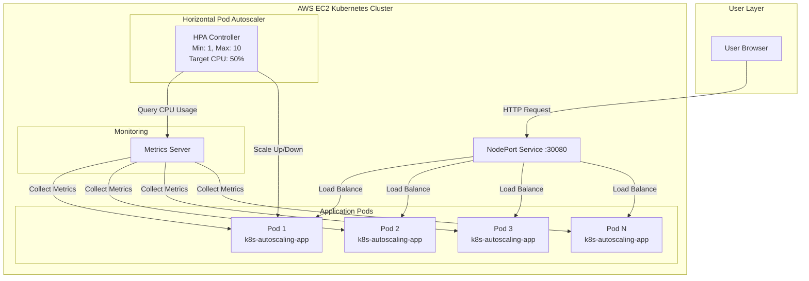
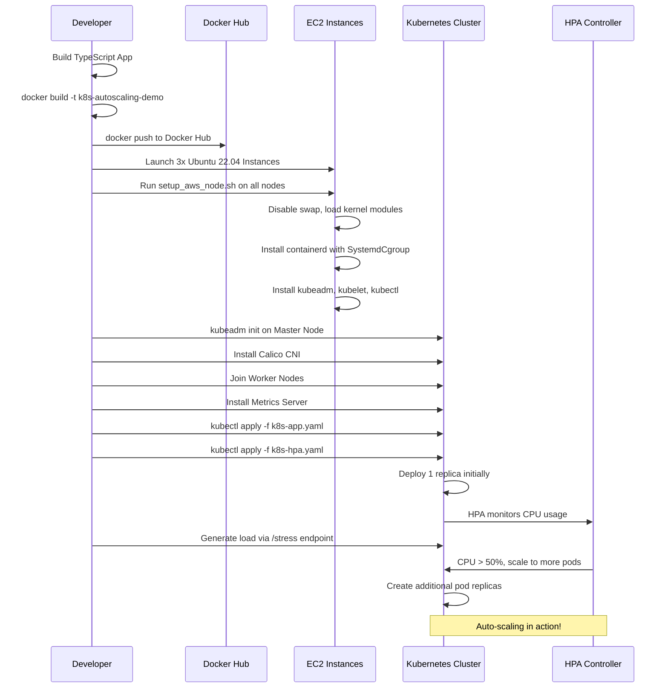

# Kubernetes Autoscaling on AWS EC2

A production-ready demonstration of **Horizontal Pod Autoscaling (HPA)** on a self-managed Kubernetes cluster running on AWS EC2 instances (without EKS). This project features a modern Node.js/TypeScript application with a stunning glassmorphism UI design.

## Project Overview

This project showcases:
- Self-managed Kubernetes cluster on raw EC2 instances
- Horizontal Pod Autoscaler (HPA) with CPU-based scaling
- Real-time monitoring dashboard with Server-Sent Events
- CPU stress testing endpoint for autoscaling validation
- Multi-stage Docker builds for optimized container images
- Complete infrastructure automation scripts
- Tested on Fedora with Minikube + Podman (rootless)

---

## Architecture Diagram



---

## Deployment Workflow



---

## Project Structure

```
AWS_project/
├── src/
│   └── server.ts              # Node.js/TypeScript application
├── Dockerfile                 # Multi-stage Docker build
├── .dockerignore             # Docker build exclusions
├── package.json              # Node.js dependencies
├── tsconfig.json             # TypeScript configuration
├── k8s-app.yaml              # Deployment + Service
├── k8s-hpa.yaml              # HorizontalPodAutoscaler
├── setup_aws_node.sh         # AWS EC2 node setup script (Ubuntu)
├── local-setup-fedora.sh     # Local prerequisites installer (Fedora)
├── local-setup-ubuntu.sh     # Local prerequisites installer (Ubuntu)
├── docker-compose.yml        # Docker Compose for local testing
├── local-test.sh             # Automated local testing script
├── load-generator.sh         # HTTP load generation for testing
└── README.md                 # This file
```

---

## Scripts Execution Order

### First Time Setup (Local Testing on Fedora/Ubuntu):

**Step 1: Install prerequisites** (one-time per machine):
```bash
# Fedora
sudo bash local-setup-fedora.sh

# Ubuntu
sudo bash local-setup-ubuntu.sh
```
**What this does:** Installs Podman (Fedora) or Docker (Ubuntu), kubectl, minikube, conntrack

**Step 2: Test with Docker Compose** (quick validation):
```bash
bash local-test.sh docker
# Opens http://localhost:3000
# Press Ctrl+C when done, then: docker compose down
```
**What this does:** Builds and runs the app in a single container (no Kubernetes, no HPA)

**Step 3: Test with Minikube** (full HPA testing):
```bash
bash local-test.sh minikube
# Follow prompts to access the service URL
# Monitor scaling with: watch kubectl get hpa
```
**What this does:** 
- Starts local Kubernetes cluster (Minikube)
- Builds and deploys app with HPA
- Auto-detects Podman/Docker and configures appropriately
- Shows service URL for testing

### First Time Setup (AWS Deployment on Ubuntu 22.04 LTS):

**Step 1: Prepare EC2 nodes** (run on EACH of 3 nodes):
```bash
# SSH to each node and run:
sudo bash setup_aws_node.sh
```
**What this does:** Configures swap, kernel modules, installs containerd, kubeadm, kubelet, kubectl

**Step 2: Initialize cluster** (see Phase 2 below for complete workflow)

---

## Phase 0: Quick Local Testing (Recommended First Step)

Before deploying to AWS, test the application locally to ensure everything works correctly.

### Option A: Simple Docker Testing (No Autoscaling)

Fastest way to verify the application:

```bash
# Start the application
bash local-test.sh docker

# Test endpoints
curl http://localhost:3000/health              # Health check
curl http://localhost:3000/                    # Dashboard  
curl http://localhost:3000/cpu-load            # CPU test (5 seconds)

# Stop the application
docker compose down
```

### Option B: Full Kubernetes Testing with Minikube (With Autoscaling)

Complete HPA demonstration (now works with both Docker and Podman):

```bash
# Automated setup - handles Docker/Podman detection
bash local-test.sh minikube

# The script will:
# 1. Detect Docker or Podman
# 2. Start Minikube with appropriate driver
# 3. Build and load the application image
# 4. Deploy app + HPA
# 5. Show service URL

# After deployment completes, get service URL:
minikube service k8s-autoscaling-service --url
# Note the URL (e.g., http://127.0.0.1:XXXXX)

# Test endpoints (replace XXXXX with actual port):
curl http://127.0.0.1:XXXXX/health
curl http://127.0.0.1:XXXXX/cpu-load

# Generate load to trigger HPA scaling:
for i in $(seq 1 100); do
    curl -s http://127.0.0.1:XXXXX/cpu-load > /dev/null &
    sleep 0.3
done

# Monitor in separate terminals:
watch kubectl get hpa
watch kubectl get pods
watch kubectl top pods
kubectl delete -f k8s-hpa.yaml
kubectl delete -f k8s-app-local.yaml
rm k8s-app-local.yaml
minikube stop
```

### Manual Local Testing Steps

If you prefer manual control:

```bash
# Install dependencies
npm install

# Build TypeScript
npm run build

# Run locally (no Docker)
npm start

# Test
curl http://localhost:3000
curl http://localhost:3000/health
curl http://localhost:3000/stress
```

---

## Phase 1: Docker Image Preparation

Once you've tested locally and confirmed everything works, prepare your Docker image for AWS deployment.

### Step 1: Build Docker Image

```bash
# Build the image
docker build -t YOUR_DOCKERHUB_USERNAME/k8s-autoscaling-demo:latest .

# Test the container locally (optional)
docker run -p 3000:3000 YOUR_DOCKERHUB_USERNAME/k8s-autoscaling-demo:latest

# Push to Docker Hub
docker login
docker push YOUR_DOCKERHUB_USERNAME/k8s-autoscaling-demo:latest
```

---

## Phase 2: AWS EC2 Deployment

### AWS Infrastructure Setup

#### Step 1: Launch EC2 Instances

Launch **3 EC2 instances** with the following specifications:

- **AMI**: Ubuntu Server 22.04 LTS
- **Instance Type**: t3.medium (2 vCPU, 4 GB RAM) - **minimum recommended**
- **Storage**: 20 GB gp3
- **Security Group**: Allow the following ports:
  - SSH (22) - Your IP
  - HTTP (80) - Anywhere
  - Custom TCP (30080) - Anywhere (NodePort)
  - Custom TCP (6443) - Cluster IPs (Kubernetes API)
  - Custom TCP (2379-2380) - Cluster IPs (etcd)
  - Custom TCP (10250-10252) - Cluster IPs (Kubelet, Scheduler, Controller)
  - Custom TCP (30000-32767) - Anywhere (NodePort range)

**Instance Naming Suggestion**:
- `k8s-master-node`
- `k8s-worker-node-1`
- `k8s-worker-node-2`

#### Step 2: Configure Security Group Rules (Detailed)

Create a security group with these **inbound rules**:

| Type | Protocol | Port Range | Source | Description |
|------|----------|------------|--------|-------------|
| SSH | TCP | 22 | Your IP | SSH Access |
| Custom TCP | TCP | 6443 | Security Group ID | Kubernetes API Server |
| Custom TCP | TCP | 2379-2380 | Security Group ID | etcd Server Client API |
| Custom TCP | TCP | 10250 | Security Group ID | Kubelet API |
| Custom TCP | TCP | 10259 | Security Group ID | kube-scheduler |
| Custom TCP | TCP | 10257 | Security Group ID | kube-controller-manager |
| Custom TCP | TCP | 30000-32767 | 0.0.0.0/0 | NodePort Services |
| Custom TCP | TCP | 80 | 0.0.0.0/0 | HTTP |

**All outbound traffic**: Allow all

---

### Kubernetes Cluster Setup

#### Step 3: Run Setup Script on All Nodes

Copy the `setup_aws_node.sh` script to all 3 nodes and execute:

```bash
# On your local machine, copy script to each node
scp -i your-key.pem setup_aws_node.sh ubuntu@<NODE_IP>:~/

# SSH into EACH node and run
ssh -i your-key.pem ubuntu@<NODE_IP>

# Execute the setup script
sudo bash setup_aws_node.sh
```

The script will:
- Disable swap
- Load kernel modules (overlay, br_netfilter)
- Configure sysctl parameters
- Install and configure containerd with **SystemdCgroup = true**
- Install kubeadm, kubelet, kubectl (v1.28)
- Hold packages to prevent auto-updates

#### Step 4: Initialize Master Node

On the **master node** only:

```bash
# Initialize the cluster
sudo kubeadm init --pod-network-cidr=192.168.0.0/16

# Set up kubectl for the ubuntu user
mkdir -p $HOME/.kube
sudo cp -i /etc/kubernetes/admin.conf $HOME/.kube/config
sudo chown $(id -u):$(id -g) $HOME/.kube/config

# Verify cluster is running
kubectl get nodes
```

**Save the `kubeadm join` command** from the output! You'll need it for worker nodes.

#### Step 5: Install Calico Network Plugin

On the **master node**:

```bash
# Install Calico CNI
kubectl apply -f https://raw.githubusercontent.com/projectcalico/calico/v3.26.1/manifests/calico.yaml

# Wait for Calico pods to be ready
kubectl get pods -n kube-system -w
```

#### Step 6: Join Worker Nodes

On **each worker node**, run the `kubeadm join` command from Step 4:

```bash
sudo kubeadm join <MASTER_IP>:6443 --token <TOKEN> \
    --discovery-token-ca-cert-hash sha256:<HASH>
```

Verify on master node:

```bash
kubectl get nodes

# Expected output:
# NAME                STATUS   ROLES           AGE   VERSION
# k8s-master-node     Ready    control-plane   5m    v1.28.x
# k8s-worker-node-1   Ready    <none>          2m    v1.28.x
# k8s-worker-node-2   Ready    <none>          2m    v1.28.x
```

#### Step 7: Install Metrics Server

The Metrics Server is **required** for HPA to function:

```bash
# Download metrics-server manifest
wget https://github.com/kubernetes-sigs/metrics-server/releases/latest/download/components.yaml

# Edit the manifest to add --kubelet-insecure-tls flag
# This is needed for self-signed certificates
sed -i '/- args:/a\        - --kubelet-insecure-tls' components.yaml

# Apply the manifest
kubectl apply -f components.yaml

# Verify metrics-server is running
kubectl get deployment metrics-server -n kube-system

# Wait for metrics to be available (may take 1-2 minutes)
kubectl top nodes
kubectl top pods
```

---

### Application Deployment

#### Step 8: Update Kubernetes Manifests

Edit `k8s-app.yaml` and replace `YOUR_DOCKERHUB_USERNAME` with your actual Docker Hub username:

```yaml
image: YOUR_DOCKERHUB_USERNAME/k8s-autoscaling-demo:latest
```

#### Step 9: Deploy Application

```bash
# Apply the deployment and service
kubectl apply -f k8s-app.yaml

# Apply the HPA
kubectl apply -f k8s-hpa.yaml

# Verify deployment
kubectl get deployments
kubectl get pods
kubectl get svc
kubectl get hpa
```

#### Step 10: Access the Application

```bash
# Get the external IP of any node
kubectl get nodes -o wide

# Access via browser:
# http://<ANY_NODE_IP>:30080
```

You should see the beautiful glassmorphism landing page with the pod name displayed!

---

## Testing Autoscaling on AWS

### Method 1: Manual Browser Testing

1. Open `http://<NODE_IP>:30080` in your browser
2. Click the **"🔥 Trigger CPU Load"** button multiple times
3. Each click generates 30 seconds of CPU-intensive calculations

### Method 2: Automated Load Testing

```bash
# Terminal 1: Watch HPA in real-time
watch -n 1 kubectl get hpa

# Terminal 2: Watch pods scaling
watch -n 1 kubectl get pods

# Terminal 3: Generate continuous load
for i in {1..100}; do
  curl http://<NODE_IP>:30080/stress &
done
```

### Expected Behavior

1. **Initial State**: 1 pod running (as defined in deployment)
2. **Load Applied**: CPU usage increases above 50%
3. **HPA Triggers**: New pods are created (up to 10 max)
4. **Load Balancing**: Requests distributed across all pods
5. **Load Removed**: After 60 seconds, HPA scales down gradually

### Monitoring Commands

```bash
# Watch HPA status
kubectl get hpa k8s-autoscaling-hpa --watch

# Check detailed HPA description
kubectl describe hpa k8s-autoscaling-hpa

# View pod CPU/Memory usage
kubectl top pods

# View logs from specific pod
kubectl logs <POD_NAME>

# Get events related to scaling
kubectl get events --sort-by='.lastTimestamp' | grep -i hpa
```

---

## Understanding the HPA Configuration

The `k8s-hpa.yaml` defines sophisticated scaling behavior:

```yaml
minReplicas: 1          # Start with 1 pod
maxReplicas: 10         # Scale up to 10 pods maximum
averageUtilization: 50  # Target 50% CPU usage

# Scale Up Policy
scaleUp:
  stabilizationWindowSeconds: 0  # Scale up immediately
  policies:
    - type: Percent
      value: 100           # Double the pods
      periodSeconds: 15    # Every 15 seconds
    - type: Pods
      value: 2             # Or add 2 pods
      periodSeconds: 15    # Every 15 seconds

# Scale Down Policy
scaleDown:
  stabilizationWindowSeconds: 60  # Wait 60s before scaling down
  policies:
    - type: Percent
      value: 50            # Remove 50% of pods
      periodSeconds: 15    # Every 15 seconds
    - type: Pods
      value: 1             # Or remove 1 pod
      periodSeconds: 15    # Every 15 seconds
```

---

## Troubleshooting

### HPA Shows "unknown" for Targets

```bash
# Check if metrics-server is running
kubectl get deployment metrics-server -n kube-system

# Check metrics-server logs
kubectl logs -n kube-system deployment/metrics-server

# Verify metrics are available
kubectl top nodes
kubectl top pods
```

**Solution**: Wait 1-2 minutes for metrics-server to collect data, or restart it:

```bash
kubectl rollout restart deployment metrics-server -n kube-system
```

### Pods Not Scaling

```bash
# Check HPA events
kubectl describe hpa k8s-autoscaling-hpa

# Check pod resource limits
kubectl describe deployment k8s-autoscaling-app
```

**Common issues**:
- Resource requests/limits not defined → Add to deployment
- Metrics server not running → Install and verify
- CPU not reaching 50% → Generate more load

### Nodes Not Ready

```bash
# Check node status
kubectl get nodes

# Check kubelet logs
sudo journalctl -u kubelet -f

# Check containerd
sudo systemctl status containerd
```

### Cannot Access Application via NodePort

1. **Check Security Group**: Ensure port 30080 is open
2. **Check Service**: `kubectl get svc` - verify NodePort is 30080
3. **Check Pods**: `kubectl get pods` - ensure pods are Running
4. **Check Firewall**: `sudo ufw status` (if enabled)

---

## Performance Optimization

### For Production Use

1. **Use LoadBalancer Service** instead of NodePort:
   ```yaml
   type: LoadBalancer  # Requires AWS Load Balancer Controller
   ```

2. **Add Resource Quotas**:
   ```yaml
   apiVersion: v1
   kind: ResourceQuota
   metadata:
     name: compute-quota
   spec:
     hard:
       requests.cpu: "10"
       requests.memory: 20Gi
       limits.cpu: "20"
       limits.memory: 40Gi
   ```

3. **Implement Pod Disruption Budgets**:
   ```yaml
   apiVersion: policy/v1
   kind: PodDisruptionBudget
   metadata:
     name: k8s-autoscaling-pdb
   spec:
     minAvailable: 1
     selector:
       matchLabels:
         app: k8s-autoscaling
   ```

4. **Use Cluster Autoscaler** to scale nodes automatically

---

## Cleanup

### Delete Kubernetes Resources

```bash
kubectl delete -f k8s-hpa.yaml
kubectl delete -f k8s-app.yaml
```

### Destroy Kubernetes Cluster

On each node:

```bash
sudo kubeadm reset -f
sudo rm -rf /etc/cni /etc/kubernetes /var/lib/kubelet /var/lib/etcd
```

### Terminate EC2 Instances

Go to AWS Console → EC2 → Instances → Select instances → Terminate

---

## Key Technologies

- **Kubernetes**: v1.28
- **Container Runtime**: containerd
- **CNI Plugin**: Calico v3.26
- **Metrics**: Metrics Server
- **Application**: Node.js 20 + TypeScript 5
- **Web Framework**: Express 4
- **Container**: Docker multi-stage build
- **Cloud**: AWS EC2 (Ubuntu 22.04 LTS)

---

## Learning Outcomes

After completing this project, you will understand:

- How to set up a production Kubernetes cluster from scratch  
- How Horizontal Pod Autoscaling works based on CPU metrics  
- How to configure containerd with proper cgroup drivers  
- How to deploy and manage containerized applications  
- How to use Kubernetes networking (Calico CNI)  
- How to implement health checks and readiness probes  
- How to optimize Docker images with multi-stage builds  
- How to troubleshoot Kubernetes clusters on AWS  

---

## Contributing

Feel free to submit issues, create pull requests, or fork this repository to make improvements!

---

## License

MIT License - feel free to use this project for learning and production purposes.

---

## Acknowledgments

- Kubernetes documentation and community
- Project Calico for networking
- AWS for infrastructure
- The open-source community

---

**Made for DevOps Engineers and Cloud Enthusiasts**
