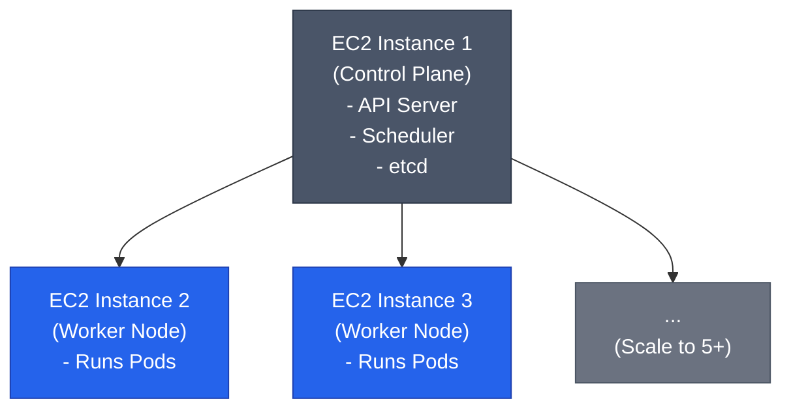
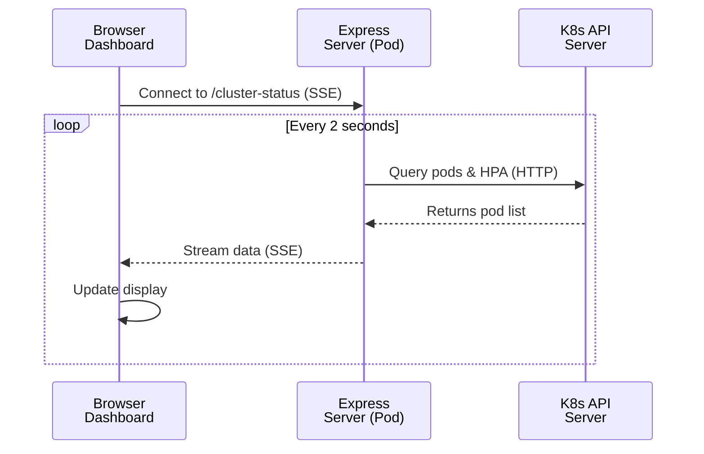
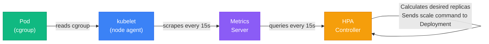

# Kubernetes Autoscaling Demo - Q&A Documentation

This document contains detailed explanations for common questions about the project's architecture, configuration, and implementation.

---

## **Question 1: What firewall rules are configured in the Security Group and what is their purpose?**

The [aws/setup-security-group.sh](../aws/setup-security-group.sh) script adds **3 critical firewall rules** to your AWS Security Group:

### **Rule 1: SSH Access (Port 22) - Your IP Only**

```bash
add_rule "tcp" "22" "${MY_IP}/32" "SSH from your IP ($MY_IP)"
```

- **What it does:** Allows you to connect to your EC2 instances from your computer
- **Why it exists:** Without this, you can't SSH into the servers to set up Kubernetes or troubleshoot issues
- **Security note:** The script automatically detects YOUR public IP and only allows SSH from that IP (the `/32` means "exactly this one IP address"). This is much safer than allowing SSH from anywhere (`0.0.0.0/0`)

### **Rule 2: NodePort 30080 - Open to Internet**

```bash
add_rule "tcp" "30080" "0.0.0.0/0" "NodePort 30080 - Dashboard access"
```

- **What it does:** Opens port 30080 to the entire internet
- **Why it exists:** Kubernetes uses "NodePort" services to expose applications. Your dashboard is accessible at `http://<server-ip>:30080`. Without this rule, the browser can't reach the dashboard
- **How Kubernetes NodePorts work:** When you deploy the app with `k8s-app.yaml`, it creates a Service with `type: NodePort` and `nodePort: 30080`. Kubernetes then opens this port on ALL nodes in the cluster and routes traffic to your application pods

### **Rule 3: Internal Cluster Communication - All Ports, SG to SG**

```bash
aws ec2 authorize-security-group-ingress \
    --group-id "$SG_ID" \
    --protocol all \
    --source-group "$SG_ID"
```

- **What it does:** Allows ANY server in this security group to talk to ANY other server in the same group on ANY port/protocol
- **Why it exists:** Kubernetes nodes need to communicate constantly:
  - **API Server** (port 6443): Worker nodes talk to the control plane
  - **Kubelet** (port 10250): Control plane sends commands to worker nodes
  - **etcd** (port 2379-2380): Kubernetes database communication
  - **Pod network** (various ports): Pods on different nodes talk to each other
  - **Metrics Server** (port 443): Collects CPU/memory metrics for HPA
- **Security note:** This is a "self-referencing rule" - servers can ONLY talk to other servers in THIS security group, not the entire internet

---

## **Question 2: What type of scaling approach does the HPA use and how does it work?**

**Yes, it's REACTIVE** - but it's also **predictive within a small time window**. Let me break it down:

### **How HPA (Horizontal Pod Autoscaler) Works:**

1. **Metrics Collection (Every 15 seconds by default):**

   - Metrics Server runs on your cluster collecting CPU usage from ALL pods
   - HPA controller queries Metrics Server: "What's the current CPU usage?"

2. **Decision Making (Reactive):**

   ```yaml
   averageUtilization: 50
   ```

   - HPA calculates: `(current CPU usage) / (target CPU usage = 50%)`
   - If pods are using **70% CPU on average** → ratio = 1.4 → **scale UP**
   - If pods are using **30% CPU on average** → ratio = 0.6 → **scale DOWN**
   - Formula: `desired_replicas = current_replicas × (current_utilization / target_utilization)`

3. **Example Scenario:**
   - You have 2 pods running
   - They're both at 80% CPU (above the 50% target)
   - HPA calculates: `2 × (80 / 50) = 2 × 1.6 = 3.2 → rounds to 4 pods`
   - HPA creates 2 more pods

### **Your Aggressive Scaling Configuration:**

**Scale UP Policy (FAST):**

```yaml
scaleUp:
  stabilizationWindowSeconds: 0 # React IMMEDIATELY, no delay
  policies:
    - type: Percent
      value: 100 # Double the pods every 15 seconds!
      periodSeconds: 15
    - type: Pods
      value: 2 # Or add at least 2 pods every 15 seconds
```

- **Translation:** "When CPU is high, PANIC and add pods FAST!"
- No stabilization window = no waiting to see if CPU spike is temporary
- Can go from 1 pod → 2 → 4 → 8 → 10 in under 1 minute

**Scale DOWN Policy (CAUTIOUS):**

```yaml
scaleDown:
  stabilizationWindowSeconds: 30 # Wait 30 seconds to confirm
  policies:
    - type: Pods
      value: 2
      periodSeconds: 30
    - type: Percent
      value: 25 # Remove max 25% of pods every 30 seconds
```

- **Translation:** "When CPU is low, wait a bit to make sure it's not a temporary dip, then scale down slowly"
- Prevents "flapping" (scaling up/down repeatedly)

### **Why It's Reactive (Not Proactive):**

- HPA doesn't predict the future - it reacts to **current** metrics
- It can't anticipate a traffic spike before it happens
- **True proactive scaling** would use machine learning to predict traffic patterns (e.g., "every Monday at 9am we get a spike")

### **Your Phased Testing Simulates This:**

In your code ([src/config/index.ts](../src/config/index.ts)), the phased test gradually increases load:

```
Warm-up → Ramp-up → Steady → Ramp-down
  20%   →  10-100% →  100%  →  100-10%
```

This lets you watch HPA **react** to changing CPU usage in real-time.

---

## **Question 3: What system configurations are modified during EC2 instance setup and why are these changes necessary?**

The [setup_aws_node.sh](../setup_aws_node.sh) script runs automatically on each EC2 instance when it boots (via AWS UserData). Here's what it does:

### **STEP 1: Disable Swap Memory**

```bash
swapoff -a
sed -i '/ swap / s/^/#/' /etc/fstab
```

**What swap is:** When your server runs out of RAM, Linux uses hard disk space as "virtual memory" (swap)

**Why Kubernetes REQUIRES swap disabled:**

- Kubernetes needs **predictable performance**
- If a pod's memory gets swapped to disk, it becomes 1000x slower
- Kubernetes assumes if a pod requests 512MB RAM, it gets actual RAM, not slow disk
- With swap enabled, pods could appear to have RAM but actually be using disk
- **Bottom line:** Kubernetes scheduler can't make smart decisions if swap is enabled

### **STEP 2: Load Kernel Modules**

```bash
modprobe overlay
modprobe br_netfilter
```

**What these are:**

- **`overlay`**: File system driver that allows containers to layer file systems
  - Containers need to "stack" changes on top of base images
  - Example: Base image = Ubuntu, your app adds files on top without modifying the base
- **`br_netfilter`**: Allows iptables to see bridged network traffic
  - Kubernetes pods talk through virtual network bridges
  - Without this, firewall rules won't work for pod-to-pod communication

**Why they're needed:**

- Containers share the host OS kernel
- These modules MUST be loaded for container networking to function

### **STEP 3: Configure Network Settings**

```bash
net.bridge.bridge-nf-call-iptables  = 1
net.ipv4.ip_forward                 = 1
net.bridge.bridge-nf-call-ip6tables = 1
```

**What these do:**

- **`bridge-nf-call-iptables = 1`**: Makes bridged network traffic go through iptables firewall
  - Ensures firewall rules apply to pod traffic
  - Required for NetworkPolicies (who can talk to whom)
- **`ip_forward = 1`**: Allows the server to forward network packets
  - Your EC2 instance acts as a router for pod traffic
  - Example: Pod A on Node 1 wants to talk to Pod B on Node 2 → Node 1 must forward the packet
- **`bridge-nf-call-ip6tables = 1`**: Same as above but for IPv6

**Why they're needed:**

- Kubernetes creates a "flat network" where every pod gets an IP
- Nodes must route traffic between pods
- Without IP forwarding, inter-node pod communication fails

### **STEP 4-5: Install and Configure containerd**

```bash
apt-get install -y containerd.io
sed -i 's/SystemdCgroup = false/SystemdCgroup = true/' /etc/containerd/config.toml
```

**What containerd is:** The actual engine that runs containers (not Docker, despite the URL)

**Why SystemdCgroup = true:**

- Linux uses "cgroups" (control groups) to limit container resources (CPU/memory)
- There are two cgroup drivers: `cgroupfs` and `systemd`
- **Kubernetes uses systemd, containerd defaults to cgroupfs**
- If they don't match → containers fail to start with cryptic errors
- Setting `SystemdCgroup = true` makes them match

### **STEP 6-7: Install Kubernetes Tools**

```bash
apt-get install -y kubelet kubeadm kubectl
apt-mark hold kubelet kubeadm kubectl
systemctl enable kubelet
```

- **`kubeadm`**: Command-line tool to initialize the cluster (`kubeadm init`)
- **`kubelet`**: Agent that runs on every node, manages pods
- **`kubectl`**: Command-line tool to interact with the cluster
- **`apt-mark hold`**: Prevents automatic updates (Kubernetes requires all nodes to be the same version)
- **`systemctl enable`**: Makes kubelet start automatically when server boots

---

## **Question 4: What is the infrastructure topology - how many nodes and clusters are deployed?**

### **Nodes:**

From [deploy_infra.sh](../deploy_infra.sh#L31):

```bash
INSTANCE_COUNT=3
```

**We create 3 EC2 instances by default:**

- **1 Control Plane node** (master) - runs the Kubernetes API server, scheduler, etcd database
- **2 Worker nodes** - run your application pods

**How it works:**

1. All 3 servers get the same setup via `setup_aws_node.sh` (containerd, kubeadm, kubelet)
2. You manually run `kubeadm init` on the FIRST node to make it the control plane
3. You run `kubeadm join` on the other 2 nodes to make them workers
4. The control plane doesn't run app pods by default (it's "tainted" to prevent scheduling)

### **Clusters:**

**Just 1 cluster** - a Kubernetes cluster is a logical group of nodes working together. Your 3 EC2 instances form ONE cluster named `k8s-autoscaling-demo`.

**Cluster Architecture:**



**You can change the node count:**

```bash
bash deploy_infra.sh --count 5  # Creates 5 nodes instead of 3
```

---

## **Question 5: What is the rationale behind setting the maximum replica count to 10?**

From [k8s-hpa.yaml](../k8s-hpa.yaml#L12):

```yaml
minReplicas: 1
maxReplicas: 10
```

### **Why 10? Three Practical Reasons:**

**1. Resource Limits (Prevents Runaway Scaling)**

- Each pod requests 100m CPU (0.1 cores) and limits to 500m (0.5 cores)
- A t3.medium has 2 vCPUs
- 10 pods × 0.5 CPU = 5 CPUs needed at peak
- With 2 worker nodes: 5 CPUs / 2 nodes = ~2.5 CPUs per node ✅ (fits comfortably in 2 cores)
- **If you set max to 20:** You'd need 10 CPUs, but you only have 4 total → pods would be "Pending" forever

**2. Cost Control**

- This is a demo/educational project, not production
- 10 replicas is enough to demonstrate scaling behavior
- Keeps AWS costs reasonable (3 t3.medium instances = ~$0.10/hour total)

**3. Observable Testing Window**

- HPA can scale up FAST (doubles every 15 seconds):
  - 1 → 2 → 4 → 8 → 10 in ~45 seconds
- 10 pods is enough to see:
  - Pod creation
  - Load distribution
  - CPU averaging across multiple pods
  - Scale-down behavior

**What happens if you hit the max:**

```yaml
# HPA calculates it needs 15 replicas
desired_replicas = 1 × (90% CPU / 50% target) = 1.8 → rounds to 2
= 2 × (90% / 50%) = 3.6 → rounds to 4
= 4 × (90% / 50%) = 7.2 → rounds to 8
= 8 × (90% / 50%) = 14.4 → rounds to 15
# But max is 10, so HPA stops at 10 replicas
```

The HPA will keep **trying** to scale beyond 10, but Kubernetes caps it. You'll see in HPA status: `current: 10, desired: 10` (even though the math says 15).

---

## **Question 6: How does the HPA determine scaling increments and distribute load across pods?**

### **The HPA Scaling Algorithm:**

HPA uses this formula every 15 seconds:

```
desired_replicas = ceil(current_replicas × (current_cpu / target_cpu))
```

Let me walk through a **real scaling scenario** from your config:

**Starting State:**

- 1 pod running at 10% CPU (idle)
- Target: 50% CPU

**Load Test Starts (Ramp-Up Phase):**

| Time | Load Applied   | Current Pods | Avg CPU% | HPA Calculation         | Action                  |
| ---- | -------------- | ------------ | -------- | ----------------------- | ----------------------- |
| 0s   | None           | 1            | 10%      | 1 × (10/50) = 0.2 → 1   | None (min is 1)         |
| 15s  | 40% intensity  | 1            | 60%      | 1 × (60/50) = 1.2 → 2   | **Scale to 2**          |
| 30s  | 60% intensity  | 2            | 70%      | 2 × (70/50) = 2.8 → 3   | **Scale to 3**          |
| 45s  | 80% intensity  | 3            | 75%      | 3 × (75/50) = 4.5 → 5   | **Scale to 5**          |
| 60s  | 100% intensity | 5            | 80%      | 5 × (80/50) = 8 → 8     | **Scale to 8**          |
| 75s  | 100% intensity | 8            | 65%      | 8 × (65/50) = 10.4 → 10 | **Scale to 10** (max)   |
| 90s  | 100% intensity | 10           | 45%      | 10 × (45/50) = 9 → 9    | None (within threshold) |

**Key Points:**

1. **CPU Averaging:** HPA calculates the AVERAGE CPU across ALL pods

   - Pod 1: 80%, Pod 2: 90%, Pod 3: 70% → Average = 80%

2. **Load Distribution (Kubernetes Service):**

   - Your app is exposed via a Service with `type: NodePort`
   - Service uses **round-robin load balancing**:
     ```
     Request 1 → Pod 1
     Request 2 → Pod 2
     Request 3 → Pod 3
     Request 4 → Pod 1  (cycles back)
     ```
   - This happens automatically - you don't control it

3. **Aggressive Scale-Up Policy:**
   From [k8s-hpa.yaml](../k8s-hpa.yaml#L35-L44):

   ```yaml
   scaleUp:
     stabilizationWindowSeconds: 0 # No waiting!
     policies:
       - type: Percent
         value: 100 # Can DOUBLE every 15 seconds
       - type: Pods
         value: 2 # Or add at least 2 pods
   ```

   - **Percent policy:** Can add 100% of current pods (e.g., 4 → 8)
   - **Pods policy:** Can add at least 2 pods (e.g., 1 → 3)
   - **selectPolicy: Max** → Uses whichever is MORE aggressive

4. **Gradual Scale-Down:**
   ```yaml
   scaleDown:
     stabilizationWindowSeconds: 30 # Wait 30s before scaling down
     policies:
       - type: Percent
         value: 25 # Remove max 25% every 30s
   ```
   - After load stops, HPA waits 30 seconds to confirm CPU stays low
   - Then removes 25% of pods every 30 seconds: 10 → 8 → 6 → 5 → 4 → 3 → 2 → 1

---

## **Question 7: What mechanism is used to retrieve and display pod information on the dashboard?**

### **Method: Dual-Mode Kubernetes API Access**

From [src/services/kubernetes.service.ts](../src/services/kubernetes.service.ts#L128-L174):

**Mode 1: In-Cluster API (Preferred)**

```typescript
const kc = new KubeConfig();
kc.loadFromCluster(); // Uses ServiceAccount token
const coreApi = kc.makeApiClient(CoreV1Api);

const podsResp = await coreApi.listNamespacedPod(
  "default", // Namespace
  undefined,
  undefined,
  undefined,
  undefined,
  "app=k8s-autoscaling" // Label selector (filter)
);
```

**What's happening:**

1. Your pod has a ServiceAccount (`dashboard-sa`) mounted at `/var/run/secrets/kubernetes.io/serviceaccount/token`
2. The K8s client library reads this token
3. It makes HTTPS requests to `https://kubernetes.default.svc:443/api/v1/namespaces/default/pods?labelSelector=app=k8s-autoscaling`
4. The API server checks RBAC permissions (defined in [k8s-rbac.yaml](../k8s-rbac.yaml))
5. Returns JSON with pod data

**Mode 2: kubectl Fallback (Local Development)**

```typescript
try {
  // Mode 1 tries...
} catch (err) {
  // Falls back to shell command
  const { stdout } = await exec(
    "kubectl get pods -l app=k8s-autoscaling -o json"
  );
  const items = JSON.parse(stdout).items;
}
```

### **Server-Sent Events (SSE) for Real-Time Updates:**

From [src/app.ts](../src/app.ts#L83):

```typescript
app.get("/cluster-status", (req, res) => {
  res.setHeader("Content-Type", "text/event-stream");
  res.setHeader("Cache-Control", "no-cache");
  res.setHeader("Connection", "keep-alive");

  const intervalId = setInterval(async () => {
    const status = await fetchClusterStatus(); // Calls K8s API
    res.write(`data: ${JSON.stringify(status)}\n\n`); // Sends to browser
  }, 2000); // Every 2 seconds
});
```

**Browser Side** (from [dashboard.ts](../src/templates/dashboard.ts#L233-L240)):

```javascript
const clusterES = new EventSource("/cluster-status");
clusterES.onmessage = (event) => {
  const data = JSON.parse(event.data);
  // Update pod cards, HPA metrics, etc.
  updatePodsGrid(data.pods);
  updateHPAStatus(data.hpa);
};
```

**Flow Diagram:**



### **RBAC Permission Required:**

From [k8s-rbac.yaml](../k8s-rbac.yaml):

```yaml
apiVersion: rbac.authorization.k8s.io/v1
kind: Role
metadata:
  name: pod-hpa-reader
rules:
  - apiGroups: [""] # Core API group
    resources: ["pods"] # Can read pods
    verbs: ["get", "list"] # GET /pods, LIST /pods
  - apiGroups: ["autoscaling"]
    resources: ["horizontalpodautoscalers"]
    verbs: ["get", "list"] # Can read HPA status
```

**Without this Role:** Your pods get HTTP 403 Forbidden when calling the K8s API.

---

## **Question 8: What technologies and protocols are used for initial page load and real-time updates?**

### **Initial Page Load:**

**Step 1: Browser Requests Dashboard**

```http
GET http://<node-ip>:30080/
```

**Step 2: Express Route Handler**
From [src/app.ts](../src/app.ts):

```typescript
app.get("/", (req, res) => {
  const podName = CONFIG.POD_NAME; // e.g., "k8s-autoscaling-app-7d8f9b-xyz"
  const html = generateDashboardHtml(podName);
  res.send(html);
});
```

**Step 3: HTML Generation**
From [src/templates/dashboard.ts](../src/templates/dashboard.ts#L7):

```typescript
export function generateDashboardHtml(podName: string): string {
  return `<!DOCTYPE html>
<html>
  <head>
    <style>/* Embedded CSS */</style>
  </head>
  <body>
    <h1>Kubernetes Autoscaling Dashboard</h1>
    <p>Served by pod: ${podName}</p>
    <div id="pods-grid"></div>
    <script>/* Embedded JavaScript */</script>
  </body>
</html>`;
}
```

**Why Embedded Templates?**

- No external files needed (dashboard.html, styles.css, script.js)
- Everything is in ONE TypeScript file
- Easier to package into Docker image
- Reduces HTTP requests (faster load time)

### **Real-Time Data Loading:**

**Method: Server-Sent Events (SSE) - HTTP Long Polling Alternative**

**Backend Setup:**

```typescript
app.get("/cluster-status", (req, res) => {
  // 1. Set special headers for streaming
  res.setHeader("Content-Type", "text/event-stream"); // SSE protocol
  res.setHeader("Cache-Control", "no-cache"); // No caching
  res.setHeader("Connection", "keep-alive"); // Keep TCP open

  // 2. Send data every 2 seconds
  const intervalId = setInterval(async () => {
    const status = await fetchClusterStatus(); // Query K8s API
    res.write(`data: ${JSON.stringify(status)}\n\n`); // Send to client
  }, 2000);

  // 3. Cleanup when browser disconnects
  req.on("close", () => {
    clearInterval(intervalId);
  });
});
```

**Frontend Connection:**

```javascript
// Browser opens a persistent connection
const eventSource = new EventSource("/cluster-status");

// Receive messages
eventSource.onmessage = (event) => {
  const data = JSON.parse(event.data);

  // Update DOM elements
  document.getElementById("pod-count").textContent = data.pods.length;
  document.getElementById("cpu-usage").textContent = data.hpa.cpu;

  // Add new pod cards
  data.pods.forEach((pod) => {
    const card = createPodCard(pod);
    document.getElementById("pods-grid").appendChild(card);
  });
};
```

**SSE vs WebSockets vs Polling:**

| Method              | How It Works                               | Your Project                                     |
| ------------------- | ------------------------------------------ | ------------------------------------------------ |
| **SSE (Used Here)** | Server pushes data to client over HTTP     | ✅ Simple, one-way (server→client)               |
| WebSockets          | Full duplex (bidirectional) TCP connection | ❌ Overkill (you don't send data to server)      |
| Polling             | Client asks "any updates?" every X seconds | ❌ Wasteful (creates new HTTP request each time) |

### **Load Test Methods:**

**Quick Load Test:**

```javascript
document.getElementById("start-stress").onclick = async () => {
  const response = await fetch("/stress/start", { method: "POST" });
  // Backend calls /cpu-load on all pods
};
```

**Backend Distributes Load:**
From [src/services/stress.service.ts](../src/services/stress.service.ts):

```typescript
export async function startStressTest(): Promise<void> {
  const podIPs = await getPodIPs(); // Get all pod IPs from K8s API

  // Call /cpu-load on EACH pod in parallel
  const promises = podIPs.map((ip) =>
    fetch(`http://${ip}:3000/cpu-load`, {
      method: "POST",
      body: JSON.stringify({ concurrency: 8 }),
    })
  );

  await Promise.all(promises); // Wait for all pods to start stressing
}
```

**Why distribute load?**

- If you only stress Pod 1, only Pod 1 has high CPU → HPA averages across all pods → no scaling
- By stressing ALL pods, the average CPU goes up → triggers scaling

---

## **Question 9: Which metrics are collected and how are they used for autoscaling decisions?**

### **Primary Metric: CPU Utilization**

From [k8s-hpa.yaml](../k8s-hpa.yaml#L14-L18):

```yaml
metrics:
  - type: Resource
    resource:
      name: cpu # Only CPU, not memory
      target:
        type: Utilization
        averageUtilization: 50 # Target: 50%
```

**How CPU is calculated:**

```
CPU% = (current CPU usage) / (requested CPU) × 100
```

From [k8s-app.yaml](../k8s-app.yaml#L26-L28):

```yaml
resources:
  requests:
    cpu: 100m # 0.1 cores = 100 millicores
```

**Examples:**

- Pod using 50m → 50m / 100m = 50% ✅ (at target)
- Pod using 75m → 75m / 100m = 75% ⚠️ (above target, scale up)
- Pod using 25m → 25m / 100m = 25% ✅ (below target, scale down)

**Average Across ALL Pods:**

```
Average CPU = (Pod1_CPU + Pod2_CPU + ... + PodN_CPU) / N

Example with 3 pods:
Pod 1: 80%
Pod 2: 60%
Pod 3: 70%
Average = (80 + 60 + 70) / 3 = 70%
```

### **Data Collection: Metrics Server**

Kubernetes doesn't track CPU by default. You must install **Metrics Server**:

```bash
kubectl apply -f https://github.com/kubernetes-sigs/metrics-server/releases/latest/download/components.yaml
```

**How it works:**



**Metrics Collected by Metrics Server:**

- `container_cpu_usage_seconds_total` (from cgroups)
- `container_memory_working_set_bytes`

**Metrics NOT Collected:**

- ❌ Network traffic (bytes in/out)
- ❌ Disk I/O
- ❌ Custom metrics (e.g., requests per second)

### **Dashboard Metrics (What You See):**

From your SSE data structure:

```typescript
{
  pods: [
    {
      name: "k8s-autoscaling-app-xyz",
      status: "Running",
      ip: "192.168.1.5",
      cpu: "75%",       // From Metrics Server
      memory: "128Mi",  // From Metrics Server
      ready: true,
      restartCount: 0,
      age: "3m"
    }
  ],
  hpa: {
    current: 5,      // Current replica count
    desired: 8,      // What HPA wants to scale to
    min: 1,
    max: 10,
    cpu: "68%"       // Average CPU across all pods
  }
}
```

### **Test Suite Metrics (Results):**

From [src/services/stress.service.ts](../src/services/stress.service.ts#L43-L52):

```typescript
interface TestSuiteResults {
  iterations: number; // Total test runs
  completed: number; // Successful runs
  avgScaleUpTimeMs: number; // Avg time to reach max replicas
  avgScaleDownTimeMs: number; // Avg time to return to min
  avgPeakReplicas: number; // Avg max pods reached
  avgPeakCpu: number; // Avg max CPU seen
  minScaleUpTimeMs: number; // Fastest scale-up
  maxScaleUpTimeMs: number; // Slowest scale-up
}
```

**How Scale-Up Time is Measured:**

```typescript
const startReplicas = await getCurrentReplicaCount(); // e.g., 1
const startTime = Date.now();

// Apply load...
await runPhasedTest();

// Poll until max replicas reached
while (currentReplicas < maxReplicas) {
  await sleep(2000);
  currentReplicas = await getCurrentReplicaCount();
}

const scaleUpTime = Date.now() - startTime; // e.g., 45000ms (45 seconds)
```

---

## **Question 10: What insights does the test results section provide about HPA performance?**

### **Results Section Purpose:**

After running **10 iterations** of the phased load test, you get aggregated statistics to answer:

- **"Is my HPA configuration optimal?"**
- **"How fast does my cluster respond to load?"**
- **"Is scaling consistent, or does it vary wildly?"**

### **Results Breakdown:**

From [dashboard.ts](../src/templates/dashboard.ts#L528-L537):

**1. Iterations**

```javascript
document.getElementById("result-iterations").textContent = results.completed;
```

- **What it shows:** `10` (or however many tests completed)
- **Why it matters:** More iterations = more statistically valid results
- **What you want:** All 10 to complete successfully

**2. Avg Scale-Up Time**

```javascript
document.getElementById("result-avg-scaleup").textContent =
  (results.avgScaleUpTimeMs / 1000).toFixed(1) + "s"; // e.g., "42.3s"
```

- **What it shows:** Average time for replicas to go from 1 → 10 (max)
- **Why it matters:** Faster scale-up = better responsiveness to traffic spikes
- **What you want:** <60 seconds (your aggressive config should achieve ~30-45s)

**Example:**

```
Iteration 1: 38s
Iteration 2: 42s
Iteration 3: 45s
...
Average: 41.2s
```

**3. Avg Scale-Down Time**

```javascript
document.getElementById("result-avg-scaledown").textContent =
  (results.avgScaleDownTimeMs / 1000).toFixed(1) + "s"; // e.g., "95.7s"
```

- **What it shows:** Time to go from 10 → 1 replicas after load stops
- **Why it matters:** Slower is often better (prevents flapping)
- **What you want:** 90-120 seconds (matches your 30s stabilization window + 25% per 30s policy)

**4. Avg Peak Replicas**

```javascript
document.getElementById("result-peak-replicas").textContent =
  results.avgPeakReplicas.toFixed(1) + " pods"; // e.g., "9.8 pods"
```

- **What it shows:** Average maximum pods reached during the test
- **Why it matters:** Should be close to `maxReplicas: 10` if load is high enough
- **What you want:** 8-10 (if it's ~5, your load test isn't strong enough)

**5. Avg Peak CPU**

```javascript
document.getElementById("result-peak-cpu").textContent =
  results.avgPeakCpu.toFixed(0) + "%"; // e.g., "82%"
```

- **What it shows:** Highest average CPU across all pods during steady phase
- **Why it matters:** Should be above 50% (your target) to trigger scaling
- **What you want:** 60-90% (too low = no scaling, too high = pods might crash)

**6. Min/Max Scale-Up Time**

```javascript
document.getElementById("result-min-scaleup").textContent =
  (results.minScaleUpTimeMs / 1000).toFixed(1) + "s"; // e.g., "35.2s"

document.getElementById("result-max-scaleup").textContent =
  (results.maxScaleUpTimeMs / 1000).toFixed(1) + "s"; // e.g., "58.1s"
```

- **What it shows:** Fastest and slowest scale-up times
- **Why it matters:** Large variance indicates inconsistent performance
- **What you want:** Max - Min < 20s (consistent scaling)

**Example Results Interpretation:**

```
✅ GOOD RESULTS:
Iterations: 10
Avg Scale-Up: 38.5s
Avg Scale-Down: 105.2s
Avg Peak Replicas: 9.7 pods
Avg Peak CPU: 75%
Min Scale-Up: 34.1s
Max Scale-Up: 45.8s

Analysis: Consistent, fast scaling. HPA is well-tuned.
```

```
⚠️ PROBLEMATIC RESULTS:
Iterations: 10
Avg Scale-Up: 120.5s      ← TOO SLOW
Avg Scale-Down: 35.2s     ← TOO FAST (flapping risk)
Avg Peak Replicas: 4.2    ← NOT SCALING ENOUGH
Avg Peak CPU: 35%         ← LOAD TOO LOW
Min Scale-Up: 45.2s
Max Scale-Up: 215.8s      ← WILDLY INCONSISTENT

Analysis: HPA misconfigured or insufficient load.
```

### **What to Do With Results:**

**If scale-up is too slow:**

- Increase `scaleUp.policies.value` (make it more aggressive)
- Decrease `scaleUp.periodSeconds` (check more frequently)

**If replicas don't hit max:**

- Increase load intensity in `CONFIG.STRESS.CONCURRENCY`
- Check if your pod CPU limits are too high (pods can handle more load than expected)

**If results are inconsistent (large min/max gap):**

- Metrics Server might be slow (check its performance)
- Network issues between nodes
- Insufficient node resources (pods waiting for scheduling)

---

## **Summary Table:**

| Question                 | Answer                                                                                              |
| ------------------------ | --------------------------------------------------------------------------------------------------- |
| **1. Security Rules**    | SSH (port 22), NodePort 30080, internal cluster communication (all ports)                           |
| **2. Scaling Approach**  | Reactive: HPA monitors CPU every 15s, scales based on 50% target                                    |
| **3. EC2 Configuration** | Disable swap, enable kernel modules, configure networking, install containerd + k8s tools           |
| **4. Nodes/Clusters**    | 3 nodes (1 control plane + 2 workers) forming 1 cluster                                             |
| **5. Why max 10**        | Fits in 2-worker capacity, cost control, observable for demo                                        |
| **6. Distribution**      | HPA averages CPU across all pods; Service round-robins requests; scales up/down based on 50% target |
| **7. Fetching pods**     | K8s API via `@kubernetes/client-node` or kubectl fallback; SSE streams updates every 2s             |
| **8. Loading methods**   | Embedded HTML template served by Express; SSE for real-time updates; distributed stress via pod IPs |
| **9. Metrics**           | CPU utilization (from Metrics Server); test metrics: scale-up/down time, peak replicas, peak CPU    |
| **10. Results section**  | Aggregated statistics from 10 iterations showing HPA performance, consistency, and responsiveness   |
