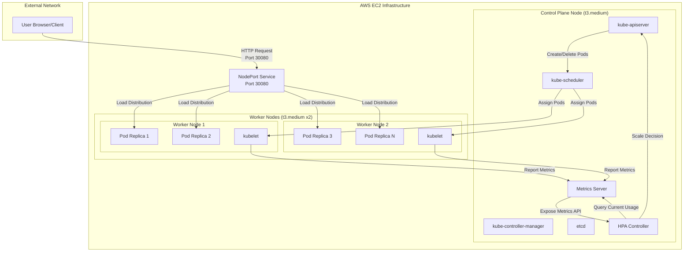
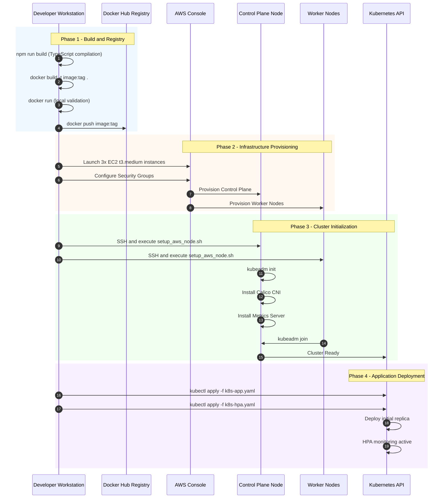
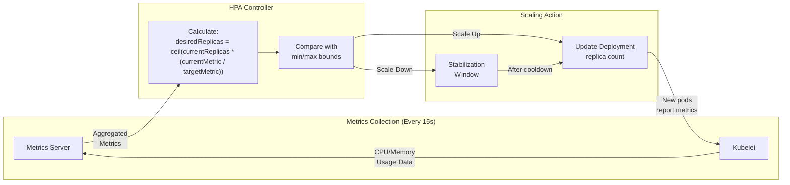
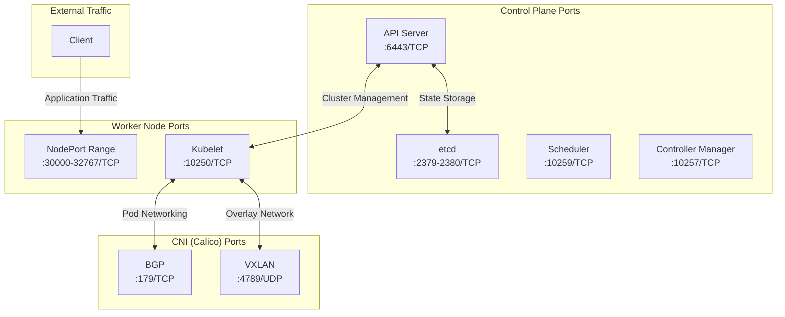
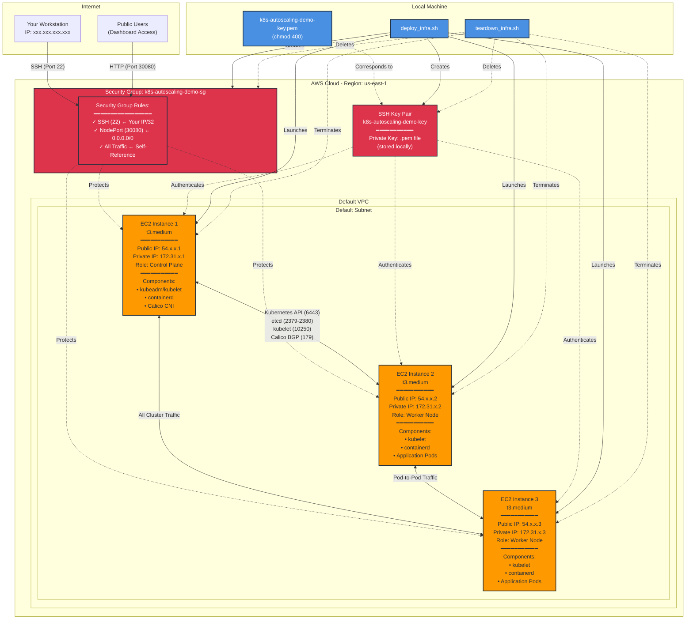

# Architecture Reference

This document provides detailed architecture diagrams and technical explanations for the Kubernetes Autoscaling Demo project.

---

## Table of Contents

1. [System Architecture](#system-architecture)
2. [Deployment Workflow](#deployment-workflow)
3. [HPA Decision Loop](#hpa-decision-loop)
4. [Network Communication Flow](#network-communication-flow)
5. [AWS Infrastructure Architecture](#aws-infrastructure-architecture)

---

## System Architecture

This diagram depicts the flow of user requests through the Kubernetes cluster and the feedback loop that enables autoscaling.



---

## Deployment Workflow

This sequence diagram illustrates the complete deployment pipeline from local development to production operation.



---

## HPA Decision Loop

This diagram illustrates the continuous feedback loop that governs autoscaling decisions.



### HPA Scaling Formula

The HPA uses this formula to calculate desired replicas:

```
desiredReplicas = ceil(currentReplicas * (currentCPU / targetCPU))
```

**Example:** If current replicas = 2, current CPU = 75%, target CPU = 50%:

```
desiredReplicas = ceil(2 * (75% / 50%)) = ceil(3) = 3 replicas
```

---

## Network Communication Flow

This diagram details the network ports and protocols required for cluster communication.



---

## AWS Infrastructure Architecture

This diagram illustrates the AWS resources created by `deploy_infra.sh` and how security group rules control access.



### Key Infrastructure Components

1. **Security Group** (`k8s-autoscaling-demo-sg`):

   - Acts as a virtual firewall for all instances
   - Three types of rules:
     - **SSH (22)**: Restricted to your public IP for administrative access
     - **NodePort (30080)**: Open to the internet for dashboard access
     - **Self-Reference**: Allows all traffic between instances (enables Kubernetes cluster communication)

2. **EC2 Instances** (3x t3.medium):

   - Each instance has public IP (for external access) and private IP (for internal communication)
   - All instances share the same security group
   - User data script automatically installs Kubernetes components on first boot

3. **SSH Key Pair** (`k8s-autoscaling-demo-key`):

   - Created by `deploy_infra.sh` and saved locally as `.pem` file
   - Used to authenticate SSH connections to all instances
   - Private key never leaves your local machine

4. **Internal Communication**:

   - Self-referencing security group rule enables all instances to communicate freely
   - Required for Kubernetes control plane communication (API server, etcd, kubelet)
   - Required for pod networking via Calico CNI

5. **Deployment Scripts**:
   - `deploy_infra.sh`: Creates all AWS resources in correct order
   - `teardown_infra.sh`: Safely destroys all resources to prevent charges

### Security Model

- **External Access**: Only SSH (from your IP) and NodePort 30080 (public) are exposed
- **Internal Access**: All ports open between cluster nodes for Kubernetes operation
- **Authentication**: SSH key pair required for terminal access
- **Isolation**: VPC and security group provide network isolation from other AWS resources

---

## Technical Glossary

| Term                                  | Definition                                                                                                                                                                                                                                                                                             |
| ------------------------------------- | ------------------------------------------------------------------------------------------------------------------------------------------------------------------------------------------------------------------------------------------------------------------------------------------------------ |
| **NodePort**                          | A Kubernetes Service type that exposes an application on a static port (range 30000-32767) on every node in the cluster. External traffic can reach the application by connecting to any node's IP address on the designated port.                                                                     |
| **Horizontal Pod Autoscaler (HPA)**   | A Kubernetes controller that automatically adjusts the number of pod replicas in a deployment based on observed metrics (typically CPU or memory utilization). The HPA increases replicas when demand rises and decreases them when demand falls.                                                      |
| **Kubelet**                           | The primary node agent that runs on every worker node in the cluster. It ensures that containers described in PodSpecs are running and healthy. The kubelet communicates with the control plane to receive instructions and report node status.                                                        |
| **CNI (Container Network Interface)** | A specification and set of libraries for configuring network interfaces in Linux containers. In Kubernetes, CNI plugins (such as Calico, Flannel, or Weave) provide pod-to-pod networking across nodes.                                                                                                |
| **SystemdCgroup**                     | A configuration option for container runtimes that delegates cgroup (control group) management to systemd rather than the container runtime itself. This ensures consistency with how Kubernetes manages resource allocation and is required when using systemd as the init system.                    |
| **Swap Memory**                       | A portion of disk storage used as virtual memory when physical RAM is exhausted. Kubernetes requires swap to be disabled because the scheduler assumes predictable memory availability; swap introduces latency and unpredictable performance that conflicts with Quality of Service (QoS) guarantees. |
| **Metrics Server**                    | A cluster-wide aggregator of resource usage data. It collects CPU and memory metrics from kubelets and exposes them through the Kubernetes API. The HPA relies on Metrics Server data to make scaling decisions.                                                                                       |
| **Control Plane**                     | The set of components that manage the overall state of the cluster, including the API server, scheduler, controller manager, and etcd. The control plane makes global decisions about the cluster and detects and responds to cluster events.                                                          |
| **etcd**                              | A distributed key-value store that serves as the backing store for all Kubernetes cluster data. It stores configuration data, state, and metadata that the control plane requires to function.                                                                                                         |
| **Calico**                            | A CNI plugin that provides networking and network policy enforcement for Kubernetes. It uses BGP (Border Gateway Protocol) to route traffic between nodes without encapsulation, offering high performance.                                                                                            |
